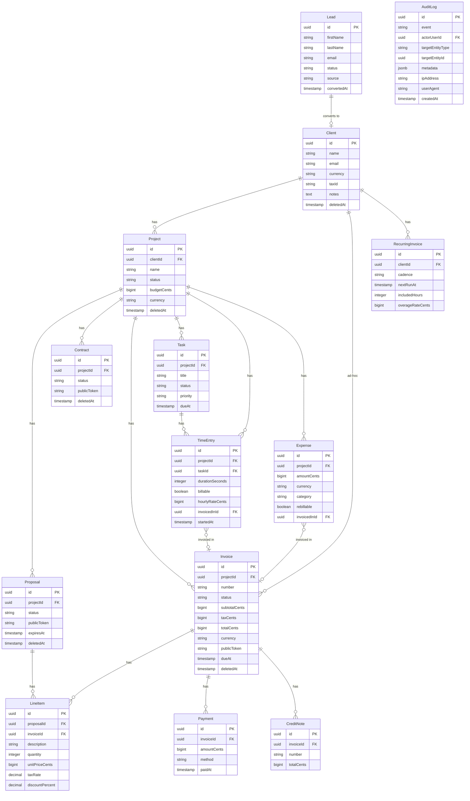

# Remit — Architecture

> This document is the authoritative technical reference for Remit. It describes what the system is,
> why it is designed the way it is, and how its parts compose into a coherent whole. It is written
> for engineers who want to understand the system deeply before contributing to it, for evaluators
> reading the codebase as a portfolio artefact, and for the author as a living record of every
> significant architectural decision.
>
> Sections are refined in place as the system evolves. Nothing is deleted.
>
> **Scope.** This document covers system architecture and the _why_ behind it. Coding conventions -
> file naming, component patterns, form structure, import order, testing layout — are owned by the
> rule files in `.claude/rules/` and are referenced from here, not duplicated. The final database
> schema is owned by `SCHEMA.md` in this directory.

---

## Table of contents

1. [What Remit is](#1-what-remit-is)
2. [Design philosophy](#2-design-philosophy)
3. [Domain model](#3-domain-model)
4. [System architecture](#4-system-architecture)
5. [Module boundaries](#5-module-boundaries)
6. [Business logic layer](#6-business-logic-layer)
7. [Data layer](#7-data-layer)
8. [Event bus](#8-event-bus)
9. [Security architecture](#9-security-architecture)
10. [Multi-user model](#10-multi-user-model)
11. [Frontend architecture](#11-frontend-architecture)
12. [API surface](#12-api-surface)
13. [Infrastructure and deployment](#13-infrastructure-and-deployment)
14. [Self-hosting experience](#14-self-hosting-experience)
15. [Internationalization](#15-internationalization)
16. [Observability](#16-observability)
17. [Testing strategy](#17-testing-strategy)
18. [Plugin system](#18-plugin-system)
19. [Hosted offering](#19-hosted-offering)
20. [Open architectural questions](#20-open-architectural-questions)
21. [Architecture Decision Records](#21-architecture-decision-records)

---

## 1. What Remit is

Remit is an open-source, self-hostable business management application for independent freelancers.
It covers the complete money lifecycle of an independent professional: from first contact with a
potential client, through project execution and time tracking, to invoicing, payment collection,
expense management, and end-of-year reporting.

The market is saturated with fragmented SaaS tools. Platforms like Plutio, Bonsai, HoneyBook,
Harvest, Toggl, and Invoice Ninja each solve fragments of this problem. Remit's thesis is that no
single competitor combines all three of the following properties:

**Self-hosted by default.** The user owns the database, the uploaded files, and the email transport.
No vendor can change pricing, lose data, deprecate the product, or access client information without
the user's knowledge.

**Privacy-first by architecture.** Sensitive credentials are encrypted at rest. Email and payment
providers are pluggable and user-selected — they are never forced. The system is designed so that
data covered by an NDA or contractual confidentiality requirement never needs to leave the user's
own infrastructure.

**Single-instance simplicity.** Every domain entity is implicitly owned by the instance. There is no
multi-tenancy in the application code, no per-seat pricing logic in the schema. Multi-user support
exists as a layered addition (owner, accountant, assistant) — see the Multi-user model section — and
never introduces tenant scoping into domain queries. A managed Hosted offering exists alongside
self-hosting, with each customer running on a dedicated isolated instance — see the Hosted offering
section — so that the same simplification holds for both deployment models.

### Primary workflow

```
Lead ──► Client ──► Project ──► Proposal ──► Contract
                       │                         │
                       ├── Time Entries          │
                       ├── Expenses              │
                       └── Tasks                 │
                                ▼                ▼
                             Invoice ◄───────────┘
                                │
                                ├── Payments (manual or Stripe)
                                └── Credit Notes
```

Any subset of this workflow is valid. A user may create invoices directly from a client without a
project, track time without ever billing it, or skip the proposal stage entirely. The system
enforces no required progression — it adapts to the workflow the freelancer actually has.

### What Remit is not

These are explicit out-of-scope areas that define the product's boundaries as much as its features:

- **Not a multi-user team tool.** Collaborative workload balancing, resource allocation, and complex
  permission matrices are out of scope. Light multi-user support (accountant, assistant) is in
  scope; team operations are not.
- **Not a marketplace.** Remit does not help find clients. There is no public profile, bidding, or
  discovery feature.
- **Not a double-entry accounting system.** Remit produces the data that accounting tools consume.
  It does not perform bookkeeping, bank reconciliation, or statutory reporting.
- **Not a project management platform.** Tasks exist to tie work to billing. Remit does not compete
  with Linear, ClickUp, or Notion on project management depth.

---

## 2. Design philosophy

These principles govern every architectural decision. When two principles conflict, the one higher
in this list takes precedence.

### 1 — Data ownership and privacy are non-negotiable

No feature, integration, or convenience trade-off justifies sending user data through third parties
without explicit, opt-in configuration by the user. This is not aspirational — it is enforced by
architecture: every external dependency (email, payment, error tracking) is an optional adapter that
is disabled until the user provides credentials.

### 2 — Single-instance simplicity is structural

Domain entities carry no `tenantId` foreign key. Ownership is implicit to the instance. Within an
instance, multi-user adds a `role` per user account but does not partition data — every member of
the instance sees the same domain dataset, scoped only by role permissions.

This eliminates an entire class of permission-checking bugs, simplifies every query, and means the
permission model can be understood in two sentences: you own everything in your instance, and your
role decides what you can do with it. The Hosted offering preserves this by isolating each customer
in a dedicated instance — see the Hosted offering section.

### 3 — Modular architecture for a multi-year roadmap

Each feature is a closed module with explicitly enforced boundaries. The codebase is structured as
if it were already a monorepo, so future extraction of packages is mechanical. This constraint
prevents the accretion of hidden cross-feature coupling that makes large codebases impossible to
change safely.

### 4 — Pure business logic, decoupled from infrastructure

Every non-trivial calculation, state transition, and transformation lives in a named pure function
that imports nothing from Next.js, React, Drizzle, or any IO module. This is not just a testing
convenience — it is the foundation for the monorepo future and the guarantee that business logic
never becomes entangled with delivery mechanism.

### 5 — Defer what is not yet certain

When a design decision has two viable paths, choose the one that leaves the most doors open.
Features are added because they make the tool genuinely better for the freelancer's daily work — not
to achieve completeness for its own sake, and not because they might be needed someday.

### 6 — No incomplete code in the main branch

No `TODO` comments as commitments. No stubbed functions. No half-implemented features. The `main`
branch is always deployable. A feature is either done or it lives on a branch.

### 7 — Type safety to every boundary

Every server action, public endpoint, settings field, environment variable, and translation key
validates with Zod or generated types. `any` is forbidden. Non-null assertions are forbidden. The
compiler's guarantees hold all the way from the database schema to the React component.

### 8 — The self-hosting experience is part of the product

Install, upgrade, backup, restore, and recover from disaster are first-class features. The install
experience is a single command. Nothing beyond database credentials, an encryption key, and an auth
secret requires editing `.env` for typical use. see the Self-hosting experience section.

---

## 3. Domain model

### Entity relationships



### Entity lifecycle states

**Invoice**

```
draft ──► sent ──► paid
            │
            └──► (overdue - computed, not stored: dueAt < now AND status = sent)
            └──► (partially_paid - computed: sum(payments) < totalCents AND payments exist)
```

**Proposal**

```
draft ──► sent ──► accepted
                └──► rejected
                └──► expired (computed: expiresAt < now AND status = sent)
```

**Project**

```
active ◄──► on_hold
  │
  └──► completed
  └──► cancelled
```

**Lead**

```
new ──► contacted ──► qualified ──► proposal_sent ──► won ──► (converted to Client)
                                                   └──► lost
```

**Contract**

```
draft ──► sent ──► signed
                └──► expired
                └──► terminated
```

**RecurringInvoice**

```
active ──► completed (end condition met: count or date)
```

### Key invariants

- A proposal is immutable after acceptance. Editing an accepted proposal creates an immutable
  historical version; the original is preserved.
- An invoice number, once assigned, is permanent and never reused. The sequence is per-prefix and
  configurable in settings.
- `audit_logs` is insert-only. No UPDATE or DELETE operation for this table ever exists at the
  application level.
- Money values are always `bigint` integers representing the smallest currency unit (cents for
  EUR/USD). The ISO 4217 currency code lives on the parent entity, never on individual money
  columns.
- Domain entities carry no `tenantId` foreign key. Ownership is implicit to the instance. The
  single-instance model is structural — see the Design philosophy and Multi-user model sections.
- All domain tables carry `createdAt` and `updatedAt` timestamps (via the `timestamps` helper) and a
  `deletedAt` for soft delete (via the `softDelete` helper).

### Domain model vs. database schema

The domain model in this section is the conceptual reference. It defines entities, relationships,
lifecycles, and invariants. The actual database schema in `database/schema/` implements this model
faithfully and adds operational detail: indexes, check constraints, soft-delete columns, encryption
helpers, polymorphic patterns where pragmatic. The full table-by-table schema specification is in
`SCHEMA.md` in this directory - that is the authoritative reference for column shape, constraints,
and indexes.

A divergence between the domain model and the schema means one of the following:

1. The schema is ahead — a new feature is being implemented and the domain model has not yet been
   updated. The domain model is updated as part of merging the feature.
2. The schema is behind — the domain model describes a planned feature whose schema does not yet
   exist. This is expected; the schema implements only what is built.

A divergence that is neither of the above is a defect and is reconciled before further work
proceeds.

---

## 4. System architecture

### High-level architecture

```
┌──────────────────────────────────────────────────────────────────────────┐
│                           Browser / Client                               │
│              React 19  ·  Next.js App Router  ·  Tailwind CSS v4         │
└───────────────────┬────────────────────────────────┬─────────────────────┘
                    │  RSC + Server Actions          │  Public / anonymous
                    ▼                                ▼
  ┌─────────────────────────────┐    ┌──────────────────────────────────────┐
  │      Application Layer      │    │           Public Layer               │
  │   app/(dashboard)/**        │    │   /i/[token]   Invoice view          │
  │   app/(auth)/**             │    │   /p/[token]   Proposal acceptance   │
  │   app/(setup)/**            │    │   /c/[token]   Contract signing      │
  └──────────────┬──────────────┘    │   /s/[token]   Client portal         │
                 │                   └──────────────────────────────────────┘
                 │ calls
                 ▼
  ┌─────────────────────────────┐    ┌──────────────────────────────────────┐
  │    Business Logic Layer     │    │            Event Bus                 │
  │  features/*/services/       │◄───│   lib/events/                        │
  │  Pure functions             │    │   Typed, in-process pub/sub          │
  │  No Next / Drizzle / React  │    │   Cross-feature side-effect wiring   │
  └──────────────┬──────────────┘    └──────────────────────────────────────┘
                 │
                 ▼
  ┌─────────────────────────────┐    ┌──────────────────────────────────────┐
  │        Data Layer           │    │         External Adapters            │
  │   Drizzle ORM               │    │   Email  - SMTP or Resend            │
  │   PostgreSQL                │    │   Payments - Stripe (or others)      │
  │   database/schema/          │    │   Storage  - local FS or S3          │
  └─────────────────────────────┘    │   Error tracking - Sentry-compatible │
                                     └──────────────────────────────────────┘
```

### Technology stack

| Layer      | Technology                        | Rationale                                                                                                                               |
| ---------- | --------------------------------- | --------------------------------------------------------------------------------------------------------------------------------------- |
| Framework  | Next.js 16 (App Router)           | RSC delivers zero-JS-by-default for read-heavy pages; server actions eliminate a separate API layer for all app writes                  |
| Runtime    | Node.js ≥ 22                      | Required by better-auth; provides `crypto.timingSafeEqual` and Web Crypto APIs natively                                                 |
| Language   | TypeScript (strict)               | Type safety enforced to every runtime boundary; `any` and non-null assertions banned                                                    |
| ORM        | Drizzle                           | Thin, type-safe SQL layer; schema-as-code; migrations generated never hand-written                                                      |
| Database   | PostgreSQL                        | ACID guarantees for financial data; JSONB for audit metadata; no extra infrastructure for full-text search                              |
| Auth       | better-auth + organization plugin | TOTP plugin included; sessions; multi-user via the organization plugin (single org per instance) — see the Multi-user model section     |
| Styling    | Tailwind CSS v4                   | Design tokens as CSS variables in `globals.css`; no config file                                                                         |
| Validation | Zod                               | Runtime and compile-time safety at every boundary; single source of truth for input shape and inferred TypeScript types                 |
| Forms      | react-hook-form + zodResolver     | Controlled validation with zero unnecessary re-renders per keystroke                                                                    |
| i18n       | i18next + react-i18next + ICU     | Type-safe message keys derived from a single `Translations` type; ICU for plurals and parameters — see the Internationalization section |
| Logging    | pino                              | Structured JSON in production; one log entry per significant event, with `requestId` correlation                                        |

---

## 5. Module boundaries

### Feature module shape

Every domain feature lives under `features/<feature>/` and is a closed, independently-testable
module. Not every feature needs every file — add only what the feature requires.

```
features/<feature>/
  ├── components/          React UI. Barrel at index.ts.
  ├── hooks/               Feature-scoped hooks.
  ├── services/            Pure business logic. No framework or IO imports.
  │   └── __tests__/       Vitest unit tests. Co-located with what they test.
  ├── queries.ts           Read operations via Drizzle. Server-only.
  ├── mutations.ts         Write operations (server actions). Server-only.
  ├── schemas.ts           Zod schemas + inferred types.
  ├── types.ts             Public types not derivable from schemas.
  ├── events.ts            Event handler registration for this feature.
  └── index.ts             Public barrel. Only what other features may consume.
```

File-level conventions (component naming, hook naming, import order, type rules) are codified in the
rule files under `.claude/rules/` — see in particular `architecture.md`, `components.md`,
`hooks.md`, `imports.md`, and `types.md`.

### The boundary rule

`features/A` may import from `features/B` only through `features/B/index.ts`. Direct imports between
sibling files inside different features are a violation and are caught by ESLint
(`eslint-plugin-boundaries`).

Types from `database/schema` are the shared data substrate and are exempt from this rule — any
feature may import them directly.

```
✓  import { type Client }    from "@/features/clients"           ← barrel
✓  import { type Client }    from "@/database/schema"            ← substrate
✗  import { clientSchema }   from "@/features/clients/schemas"   ← sibling file
```

### Why closed modules

This constraint produces four concrete benefits:

**Refactoring safety.** Changing internals in `features/B` cannot silently break `features/A` as
long as the barrel contract is maintained. The compiler enforces the boundary.

**Testability.** Each module's `services/` can be tested in complete isolation with no mocking of
other features, no database, and no framework.

**Discoverability.** A new contributor reads `index.ts` and understands the public contract of a
feature in one file.

**Monorepo readiness.** When the project grows a second artefact — a CLI tool, a plugin SDK, a
documentation site — each feature is ready for extraction into `packages/<feature>` with mechanical
changes only. The boundary enforcement means no hidden coupling to unwind.

### Feature inventory

The full feature inventory and its planned extensions are documented in the project's roadmap.
Active features at any given time are reflected by the directories present in `features/` and by the
relations declared in `database/schema/`.

---

## 6. Business logic layer

### The services pattern

Every non-trivial computation lives in a named pure function inside `features/<feature>/services/`.
"Pure" means: no imports from `next/*`, `react`, `drizzle-orm/*`, `@/database`, or any module that
performs IO. The function receives its inputs as arguments and returns its output as a return value.

Representative examples by feature:

```
features/invoicing/services/
  calculateInvoiceTotal.ts       ← tax + discount arithmetic on line items
  generateInvoiceNumber.ts       ← sequence generation given prefix and last number
  canTransitionInvoiceStatus.ts  ← status transition guard, returns { allowed, reason }

features/proposals/services/
  isProposalExpired.ts           ← expiresAt vs. a given Date
  canTransitionProposalStatus.ts ← transition guard

features/timeTracking/services/
  aggregateBillableHours.ts      ← sum billable seconds, convert to hours
  resolveHourlyRate.ts           ← rate precedence: entry → task → project → client → default
  computeInvoiceableEntries.ts   ← filter + group unbilled entries for invoice line item generation

features/recurring/services/
  computeNextRunDate.ts          ← next date from cadence + last run date
  shouldGenerateInvoice.ts       ← whether a schedule is due as of a given date
```

### Why pure functions here

**Millisecond-level test feedback.** A full `services/` test suite runs without any network call,
database connection, or module mock. The test cold-start is unmeasurable.

**Refactor confidence.** When upgrading Drizzle, replacing the ORM, or migrating to a different
runtime environment, `services/` is entirely unaffected. The blast radius of infrastructure changes
is confined to the thin orchestration layer.

**Auditability.** Pure functions are easy to read and reason about in isolation. A code reviewer
does not need to understand the database schema or the request lifecycle to verify that a tax
calculation is correct.

**Future monorepo.** When a CLI tool, a worker process, or a plugin SDK needs the same business
logic, `services/` extracts to `packages/core` with no architectural change — only a move.

### Server actions as thin orchestrators

Server actions in `mutations.ts` follow a strict four-step pattern with no exceptions:

```
1. Validate   → safeParse with the feature's Zod schema. Return { error } on failure.
2. Compute    → call into services/ for any branching logic.
3. Persist    → Drizzle writes, wrapped in try/catch. Map known DB errors to friendly strings.
4. Side-effects → emit event bus event; revalidatePath/revalidateTag; write audit log if needed.
```

They return `{ data: T } | { error: string }` and never throw to the caller. The full canonical
pattern, including audit logging, event emission, and revalidation rules, is documented in
`actions.md`.

### Queries as typed read operations

Read functions in `queries.ts` use Drizzle's relational query API or raw SQL for complex
aggregations. They return typed results and perform no write operations. They are the only place in
the codebase where Drizzle reads are performed outside of server actions.

---

## 7. Data layer

### Schema organisation

One Drizzle schema file per domain entity in `database/schema/`. All schemas exported via
`database/schema/index.ts`. Generated migrations live in `drizzle/migrations/` and are never
hand-edited — the migration file is an artefact, not source code.

The full final schema specification — every table, column, constraint, index — is in `SCHEMA.md` in
this directory.

### Universal table conventions

| Convention       | Rule                                                                    | Rationale                                                                       |
| ---------------- | ----------------------------------------------------------------------- | ------------------------------------------------------------------------------- |
| Primary key      | `uuid` with `.defaultRandom()`                                          | No sequential ID leakage; safe to reference in public URLs before insertion     |
| Timestamps       | Spread `timestamps` from `database/schema/helpers.ts`                   | Consistency; `createdAt` and `updatedAt` on every table without repetition      |
| Timestamp type   | `{ withTimezone: true, mode: "date" }`                                  | Correct timezone handling; `Date` type in TypeScript                            |
| Foreign keys     | `{ onDelete: "cascade" }` by default                                    | Prevents orphaned records; explicit exception required for non-cascade cases    |
| Soft delete      | `deletedAt` via the `softDelete` helper                                 | Data is restorable; financial records survive deletion for legal retention      |
| Money            | `bigint` storing integer cents                                          | No floating-point rounding; exact arithmetic for all financial calculations     |
| Currency         | `varchar(3)` on the parent entity                                       | ISO 4217 code (e.g., `"EUR"`) stored once, not duplicated on every money column |
| Encrypted fields | `encryptedColumn()` Drizzle helper                                      | Transparent AES-256-GCM; no plaintext secrets in the database                   |
| Indexes          | Explicit for every FK used in joins and every `WHERE`/`ORDER BY` column | Prevents table scans on foreign key joins in a growing dataset                  |

Detailed conventions for schema files, including index declaration syntax and money formatting
rules, live in `database.md`.

### Money storage in depth

Floating-point types (`numeric`, `real`, `double precision`) accumulate rounding errors in financial
calculations. `10.00 * 0.23` can produce `2.3000000000000003` in IEEE 754 arithmetic. Storing money
as integer cents eliminates this entire class of bug. `1000` cents is always `€10.00`. Arithmetic on
cents is exact integer arithmetic. See ADR-0009.

Display formatting always uses `Intl.NumberFormat` with the entity's currency code:

```ts
new Intl.NumberFormat("pt-PT", {
  style: "currency",
  currency: invoice.currency
}).format(invoice.totalCents / 100)
```

### The `encryptedColumn()` helper

Fields that contain sensitive credentials are defined in the Drizzle schema using
`encryptedColumn()` from `database/schema/helpers.ts`. The helper provides:

- **Transparent encryption on write** using AES-256-GCM with a per-row random IV generated at write
  time.
- **Transparent decryption on read** - consuming code receives the plaintext value and is unaware of
  the encryption.
- The master key is loaded from `REMIT_ENCRYPTION_KEY` (a base64-encoded 32-byte key generated at
  install time by the install script).

**Loss of the encryption key means permanent, unrecoverable loss of these fields.** This is the
price of self-hosting and is documented prominently in the installation guide and setup wizard. See
ADR-0005.

### Migrations strategy

Drizzle migrations are forward-compatible. Breaking schema changes are split across two releases:
release N adds the new column as nullable; release N+1 backfills and adds the `NOT NULL` constraint.
This ensures that any running instance can be upgraded without a maintenance window.

---

## 8. Event bus

### Purpose

Cross-feature side effects are mediated by a typed, in-process event bus at `lib/events/`.

Without the bus, an action like `markInvoicePaid` must directly invoke every feature that needs to
react: write an activity log entry, write an audit log entry, invalidate the dashboard cache, send a
payment receipt email, and check whether all project invoices are now paid. Each new consumer
requires modifying the action, which violates the closed module boundary and makes the action
increasingly hard to test.

With the bus, `markInvoicePaid` emits `invoice.paid` once. Each feature registers its own handler in
`features/<feature>/events.ts` and owns its reaction entirely. See ADR-0006.

### Event naming convention

```
<entity>.<past_tense_verb>

invoice.created        invoice.sent           invoice.paid
invoice.overdue        invoice.reminder_sent  invoice.partially_paid
proposal.sent          proposal.accepted      proposal.rejected       proposal.expired
contract.sent          contract.signed        contract.expired
time.logged            time.invoiced
expense.created        expense.invoiced
payment.received
client.created         client.updated         client.deleted
lead.converted         lead.stage_changed
auth.login.succeeded   auth.login.failed      auth.password.changed
auth.totp.reconfigured auth.backup_code.consumed
settings.email.configured  settings.payment.configured  settings.security.changed
recurring.invoice_generated  retainer.pool_exhausted
member.invited         member.accepted        member.removed         invitation.canceled
```

### `invoice.paid` fan-out as a concrete example

```
emit("invoice.paid", { invoiceId })
  ├── features/activityLog/events.ts   → writes "Invoice #INV-042 marked as paid"
  ├── features/audit/events.ts         → writes security audit entry
  ├── features/dashboard/events.ts     → revalidates dashboard KPI cache tags
  ├── features/email/events.ts         → sends payment receipt if SMTP is configured
  └── features/projects/events.ts      → checks if all project invoices are paid;
                                          suggests marking project as completed
```

Each handler is owned by its feature. Adding a new consumer requires no change to the
`markInvoicePaid` action.

### Bus properties

| Property    | Value                                         | Rationale                                                                                 |
| ----------- | --------------------------------------------- | ----------------------------------------------------------------------------------------- |
| Type safety | Strongly typed event map                      | Adding an event requires extending the map; handlers are type-checked against the payload |
| Execution   | Synchronous; async handlers awaited in series | Handler failures surface as action errors; no silent background failures                  |
| Topology    | In-process, no broker                         | Correct for single-instance deployment; extractable to a queue when load demands it       |

### The bus as the foundation for plugins

The same event bus that wires cross-feature side effects today is the contract that future plugins
subscribe to. Adding ATCUD generation for Portuguese invoicing, AI-drafted proposal text, or OCR for
expense receipts is a matter of installing a plugin that registers handlers for `invoice.created`,
`proposal.created`, or `expense.created`. The event bus is therefore not just a decoupling mechanism

- it is the public extensibility surface of Remit. see the Plugin system section.

---

## 9. Security architecture

Security is a first-class feature. The goal is "demonstrably defensible" as a portfolio artefact and
"actually safe" in production self-hosted use.

### Authentication flow

```
POST /login
  │
  ├── Rate limiter check (in-memory or Redis adapter)
  │
  ├── better-auth credential verification
  │     ├── Failure → emit auth.login.failed → audit log (IP, user-agent, timestamp)
  │     └── Success → continue
  │
  ├── TOTP verification (mandatory, no bypass)
  │     ├── Failure → audit log
  │     └── Success → continue
  │
  ├── Session created (httpOnly, secure, sameSite: lax)
  │     └── activeOrganizationId set on session (always the instance organization)
  │
  └── emit auth.login.succeeded → audit log
```

### Password reset paths

Three coexisting paths, in order of availability:

1. **Email reset link** — available only when SMTP is configured and a test send has succeeded. The
   UI conditionally shows "Forgot password?" when this condition is met.

2. **CLI/admin reset** - `docker exec remit-app pnpm remit:reset-password` for self-hosted
   complete-lockout cases or environments without SMTP. Generates a temporary password, marks the
   user `mustChangePasswordOnNextLogin`, writes audit log.

TOTP is **never optional**. There is no UI to disable it. Password reset and second-factor fallback
are separate concerns: password reset happens by email or CLI/admin action, while second-factor
fallback uses Better Auth backup codes.

Better Auth **backup codes** remain enabled as part of the TOTP plugin and are stored in
`two_factors.backup_codes`. They are used only as a second-factor fallback during login when the
authenticator app is unavailable.

### Encryption at rest

| Field                          | Encryption rationale                              |
| ------------------------------ | ------------------------------------------------- |
| `settings.smtpPass`            | SMTP server credential                            |
| `settings.resendApiKey`        | Resend API key                                    |
| `settings.stripeSecretKey`     | Stripe secret key                                 |
| `settings.stripeWebhookSecret` | Stripe webhook signing secret                     |
| `settings.paymentIban`         | Sensitive banking identifier                      |
| `clients.notes`                | May contain NDA-protected or confidential content |

### The two audit logs

Two logs serve distinct purposes and must never be confused:

**Activity log** (`activity_logs`) - user-facing, friendly messages ("Invoice #INV-042 sent to Acme
Corp"), can be edited or deleted via the UI, used for "what happened this week" and client-facing
event summaries.

**Audit log** (`audit_logs`) - security-facing, append-only, immutable. No UI to delete entries.
Schema: `id`, `event`, `actorUserId | null`, `targetEntityType | null`, `targetEntityId | null`,
`metadata jsonb`, `ipAddress`, `userAgent`, `createdAt`. No `updatedAt`, no `deletedAt`. Captures:
login success/failure; password change; TOTP setup, reconfiguration; Better Auth backup-code
consumption; CLI/admin password resets; settings changes touching SMTP, Stripe, or payment
information; data exports; entity deletions; public token rotations; member changes (see the
Multi-user model section).

### Public token security

Tokens for document sharing (`/i/[token]`, `/p/[token]`, `/c/[token]`, `/s/[token]`) are:

- Generated with `crypto.randomBytes(32).toString("base64url")` — 256 bits of entropy.
- Compared with `crypto.timingSafeEqual` to prevent timing-based token enumeration.
- On token miss, the response shape and approximate response time match a "valid token, document
  archived" case to defeat enumeration via timing.
- Revocable and rotatable without losing the underlying document.
- All public token pages set `X-Robots-Tag: noindex, nofollow` and
  `<meta name="robots" content="noindex,nofollow">`.

### Rate limiting

A rate limiter with a swappable adapter (in-memory by default; Redis for multi-instance deploys)
protects every endpoint that processes authentication or a public token. Protected endpoints:
`POST /login`, `POST /register`, `/i/[token]`, `/p/[token]`, password reset requests, and all
`/api/*` routes with a per-IP backstop.

Limits are sane defaults configurable in settings.

### HTTP security headers

Set in middleware for every response:

| Header                      | Value                                                              |
| --------------------------- | ------------------------------------------------------------------ |
| `Strict-Transport-Security` | `max-age=63072000; includeSubDomains; preload` (production)        |
| `Content-Security-Policy`   | Strict with explicit allowlists for third-party assets             |
| `X-Frame-Options`           | `DENY` on all pages except those that explicitly require embedding |
| `X-Content-Type-Options`    | `nosniff`                                                          |
| `Referrer-Policy`           | `strict-origin-when-cross-origin`                                  |
| `Permissions-Policy`        | `camera=(), microphone=(), geolocation=()`                         |

Session cookies: `httpOnly: true`, `secure: true` (production), `sameSite: "lax"`. The application
refuses to start in production mode without HTTPS.

### Routing state rule

Authentication and onboarding state is derived exclusively from the database and the active session.
No routing decisions are stored in cookies. The middleware enforces a strict state machine:

```
No user record in DB             → redirect to /register
No active session                → redirect to /login
Business profile incomplete      → redirect to /setup (business step)
TOTP not enrolled                → redirect to /setup (TOTP step)
All conditions satisfied         → allow to (dashboard)
```

This rule is non-negotiable. Adding a cookie to influence routing is a violation. See ADR-0001.

### Data export and deletion

Two GDPR-aligned features:

**Export.** `/settings/data` produces a zip containing JSON of every entity, every uploaded file,
and every generated PDF. Audit-logged. Per-client export is also available for client offboarding or
right-to-portability requests.

**Soft delete and retention.** Domain entities use `deletedAt` for soft delete and are restorable
from a trash view. Hard delete is available after a configurable retention period. Hard-deleting a
client cascades to projects, proposals, and invoices in soft-delete state and requires typed-name
confirmation.

---

## 10. Multi-user model

### Why this section exists

The single-instance simplicity in see the Design philosophy section is structural: every domain
entity is owned by the instance, and there is no `tenantId` foreign key on domain tables. This
section explains how to layer light multi-user access — accountant access, an assistant — on top of
this base model **without introducing tenant scoping into domain queries**.

### The roles

Three roles, defined statically and never extended through configuration:

| Role         | Permissions                                                                                     |
| ------------ | ----------------------------------------------------------------------------------------------- |
| `owner`      | Everything. Exactly one per instance. The account created during `/register` and `/setup`.      |
| `accountant` | Read access to all entities. Can export data. Cannot create, update, send, delete, or transmit. |
| `assistant`  | Can create and edit drafts. Cannot send, mark as paid, delete, or change settings.              |

The owner is permanent and structural — it is the instance owner. Other roles are invitations, not
seats.

### Implementation: Better Auth organization plugin

Multi-user is implemented via the Better Auth organization plugin, with **a single organization per
Remit instance**. The organization is created automatically during `/setup` (named after the
business profile) and every authenticated user is a member of it. The session always carries an
`activeOrganizationId` and it is always that one organization.

This deliberately uses the plugin in a degenerate mode - multi-org-per-user is not exercised,
because a Remit instance is a single business. The benefit is inheriting the plugin's invitation
flow, role propagation, and member tables for free, while keeping the conceptual model trivial.

The installed Better Auth version is the schema contract for these tables. Remit customizes the
allowed business roles at the plugin boundary, but it does **not** invent a parallel schema for the
plugin-owned tables. If Better Auth expects `text` role/status fields, a required `slug`, or a
session-level `activeOrganizationId`, the Remit schema mirrors that exactly.

The plugin contributes the following tables to the schema:

- `organization` - exactly one row per instance, with a required unique `slug`. `metadata` follows
  Better Auth's storage contract for the installed version.
- `member` - maps `(userId, organizationId, role)`. `role` is stored in the plugin-compatible column
  shape and Remit constrains allowed values to `owner | accountant | assistant`.
- `invitation` - pending invitations with email, role, expiry, inviter, and Better Auth's status
  lifecycle (`pending | accepted | rejected | canceled` for the current version).

Domain tables remain free of `tenantId` foreign keys, queries do not change, and ownership remains
implicit to the instance. See ADR-0013.

### Authorization model

Authorization is implemented as a thin layer in two places:

**Middleware-level (route gating).** Routes under `/settings/security`, `/settings/api`, and any
endpoint that exposes the encryption key fingerprint are owner-only. Routes that perform sends or
deletions are blocked for `assistant`. All other routes are accessible to all roles.

**Action-level (operation gating).** Every server action declares its required role at the top via a
`requireRole` helper that wraps the Better Auth session and checks the active member's role:

```ts
"use server"

import { requireRole } from "@/features/auth/services/requireRole"

export async function markInvoicePaid(input: unknown) {
  await requireRole("owner")
  // ...
}

export async function createInvoiceDraft(input: unknown) {
  await requireRole(["owner", "assistant"])
  // ...
}

export async function listInvoices() {
  await requireRole(["owner", "accountant", "assistant"])
  // ...
}
```

`requireRole` reads the session, extracts the `activeMemberRole`, and returns
`{ error: "Not authorized" }` if the caller's role is insufficient. Audit log entries always include
the actor's user id and role.

### Invitation flow

1. Owner invites an email address with a role from `/settings/team`.
2. Better Auth creates an `invitation` record with the plugin's expected field shape. If SMTP is
   configured, an invitation email is sent; otherwise, the owner is shown a one-time link to share
   manually.
3. Invitee follows the link, registers (or signs in if the email already has an account), and the
   `member` row is activated.
4. The invitee enrolls TOTP - mandatory for all roles, no exceptions.

Owners can remove memberships at any time. Removal invalidates all sessions for that user.

### What multi-user does not change

- The domain model has no `tenantId` foreign keys. Adding one is a violation.
- The single-instance model is the base; multi-user is layered on top via role assignment and
  `requireRole`.
- The audit log captures the actor user id and role but never alters what gets recorded — the audit
  log is not a permission system.
- All roles must enroll TOTP through the same `/setup` flow. Backup codes are generated and shown as
  part of the Better Auth TOTP flow; password recovery remains email- or CLI/admin-based.

See ADR-0002 (single-instance model is structural) — multi-user does not supersede it; it extends
it. See ADR-0013 (Better Auth organization plugin chosen).

---

## 11. Frontend architecture

### React Server Components by default

Pages and layouts are React Server Components (RSC) by default. `"use client"` is added only when
the component requires browser APIs, event listeners, or React hooks. The result is minimal
JavaScript shipped to the browser for read-heavy pages — invoice lists, client detail, the dashboard

- while interactive components remain fully reactive.

### Component hierarchy

```
app/(dashboard)/invoices/page.tsx       Server component - fetches, composes
  └── features/invoicing/components/
        ├── InvoiceList.tsx              Server component - renders table
        ├── InvoiceFilters.tsx           Client component - search, filter UI
        └── InvoiceActions/
              ├── InvoiceActions.tsx     Client component - send, mark paid, delete
              └── DeleteInvoiceDialog.tsx  Client component - confirmation dialog
                    └── components/ui/   Shared primitives (shadcn + Radix UI)
```

Component-level conventions — file naming, decomposition rules, the `Typography` and `Icon`
primitives, the `data-slot` attribute — are codified in `components.md`.

### Forms

All forms use `react-hook-form` with `zodResolver` and a `Controller` per field. Field-level errors
surface through `FieldError`; submit-level errors render in a `FieldError` above the submit button.
The full pattern (modes, validation, accessibility attributes, server error surfacing) is documented
in `forms.md`.

### State management

There is no global client-side state library. State lives in the closest reasonable place:

| State kind                   | Location                             |
| ---------------------------- | ------------------------------------ |
| Server data                  | RSC / Next.js route cache            |
| Form state                   | react-hook-form                      |
| Dialog and UI state          | `useState` in the owning component   |
| Cross-component coordination | React context, scoped to the feature |
| URL-derived state            | `useSearchParams` / `usePathname`    |

### Design system

All standalone text uses the `Typography` component — never raw `<p>`, `<span>`, or heading elements
outside of a primitive's own implementation. All icons use `<Icon name="..." />` — never direct
imports from `lucide-react`. All design tokens (colours, radius, spacing) are CSS variables in
`app/globals.css`; there is no `tailwind.config.js`.

Before writing any visual UI, `components/ui/index.ts` is checked for an existing primitive. New UI
work never reimplements a concept that already exists in the design system.

### Accessibility

Accessibility is non-negotiable. Every interactive element is a semantic button, link, or input;
icons that convey meaning carry an accessible name; color is never the sole signal; focus is always
visible; modals trap focus. Full conventions in `accessibility.md`.

---

## 12. API surface

### Server actions vs. API routes

Server actions in `features/<feature>/mutations.ts` are the canonical write path for all
application-level interactions. API routes exist only for specific, justified cases:

| Route                  | Purpose                                      |
| ---------------------- | -------------------------------------------- |
| `/i/[token]`           | Public invoice view (anonymous)              |
| `/p/[token]`           | Public proposal acceptance (anonymous + OTP) |
| `/c/[token]`           | Public contract signing (anonymous)          |
| `/s/[token]`           | Client portal (anonymous, read-only)         |
| `/api/webhooks/stripe` | Stripe webhook event receiver                |
| `/api/health`          | Uptime monitor health check (public)         |
| `/api/metrics`         | Prometheus metrics (opt-in, token-protected) |
| `/admin/health`        | Detailed health dashboard (authenticated)    |

### Public API

A REST API mirroring the server actions, with scoped API tokens managed in `/settings/api` and
outbound webhooks configurable per event in `/settings/webhooks`. Documentation auto-generated from
Zod schemas via `zod-openapi`.

### Validation at every boundary

```
Browser input  ──►  Zod schema in features/*/schemas.ts   ──►  server action
URL params     ──►  Zod schema in the route handler        ──►  query function
Env vars       ──►  Zod schema in lib/env.ts               ──►  process fails fast at boot
Settings read  ──►  Zod schema on read and write           ──►  defensive against old data
```

No data crosses a boundary unvalidated.

---

## 13. Infrastructure and deployment

### Docker-first deployment model

The primary deployment unit is a Docker image published to GitHub Container Registry (GHCR). A
`docker-compose.yml` bundles the application and a PostgreSQL container. Two Compose profiles:

- **Default profile** — exposes a configurable port; assumes an existing reverse proxy (Nginx,
  Caddy, Traefik, Cloudflare Tunnel).
- **`with-proxy` profile** — includes Caddy with automatic Let's Encrypt TLS. One command, full
  HTTPS, zero certificate management.

### Configuration hierarchy

```
lib/env.ts           Zod-validated boot secrets. Process exits on failure.
/setup wizard        First-run UI configuration. Minimal - see the Self-hosting experience section.
/settings/**         Ongoing configuration stored in the settings table.
.env                 Only: DB connection string, encryption key, auth secret.
```

No feature reads `process.env` directly. All environment access is through `lib/env.ts`.

### Data residency

All data is stored in the PostgreSQL instance owned and operated by the user. No analytics,
telemetry, or usage data leaves the instance without explicit configuration. Error tracking (Sentry
DSN) and update checks are opt-in.

---

## 14. Self-hosting experience

The biggest friction in adopting a self-hosted application is not the feature set — it is install,
upgrade, backup, and recover. Remit treats each of these as a first-class feature.

### One-command install

```bash
curl -fsSL https://remit.dev/install.sh | bash
```

The install script:

1. Verifies Docker and Docker Compose are present; aborts with friendly instructions otherwise.
2. Prompts for: domain (or `localhost` for local-only), port, data directory.
3. Generates `.env` with all required boot secrets (database password, encryption key, auth secret).
4. Pulls the Docker image from GHCR.
5. Runs `docker compose up -d` and waits for the health check.
6. Opens the browser at `/register`.

Nothing beyond these three secrets requires editing `.env` for typical use. SMTP, Stripe, branding,
and all other configuration is done through the UI.

### Setup wizard — minimal by design

`/setup` is deliberately short. It captures only what is required to use the application securely on
the first day. Everything else is in `/settings/**` and edited when the user needs it.

**In `/setup` (mandatory):**

1. Business profile - name, default currency, locale, timezone.
2. TOTP enrollment.
3. Backup codes - generated by Better Auth as part of TOTP setup, displayed once, strongly
   encouraged to download/store safely.

**Not in `/setup` - only in `/settings/**` later:\*\*

- Logo and branding.
- Invoicing defaults (number prefix, padding width, payment terms, default notes, IBAN).
- SMTP / Resend credentials and test email.
- Stripe credentials and test connection.
- Tax rates beyond a sensible default.
- Template customization.
- Backup destination beyond local default.

This trade-off is deliberate. A long setup wizard guarantees abandonment. A short setup wizard plus
discoverable settings means a user is productive in minutes and configures advanced features when
they actually need them. Each settings section has a "test" affordance (test email, test Stripe
connection) so configuration is verifiable in place.

### Health and status

`/admin/health` (authenticated, owner-only) provides a human-readable status dashboard:

- Database connectivity.
- SMTP/Resend reachability and last successful send timestamp.
- Stripe reachability (when configured).
- Storage backend reachability.
- Last successful backup timestamp.
- Data volume disk usage.
- Encryption key fingerprint — displayed so the user can confirm it has not silently changed between
  deploys.
- Available software updates (opt-in update checks).

`/api/health` (public) returns `200` or `503` with a minimal JSON body for uptime monitors.

### Backup and restore

A scheduled job (configurable cadence, daily by default) runs `pg_dump` plus an upload tar archive,
encrypts the bundle using the master AES-256-GCM key, and stores it at the configured destination:
local filesystem (default), Amazon S3, Cloudflare R2, or Backblaze B2. Retention policy is
configurable: keep N daily, M weekly, K monthly snapshots.

Restore is interactive via the CLI:

```bash
docker exec remit-app pnpm remit:restore <backup-file>
```

The command requires explicit confirmation of the target environment. A missed backup for N
consecutive days surfaces a banner in the dashboard.

### Updates

Drizzle migrations are forward-compatible. Breaking schema changes span two releases: release N adds
the column nullable; release N+1 backfills and adds `NOT NULL`. This allows any running instance to
upgrade without a maintenance window.

The upgrade flow is one command:

```bash
docker exec remit-app pnpm remit:upgrade
```

It performs: a snapshot backup, image pull, migration run, and restart. Auto-upgrade is opt-in;
manual is the default. The CHANGELOG is published in the repository and surfaced in `/admin/health`
when an update is available.

### CLI scripts

Shipped as `pnpm` scripts inside the Docker image:

- `remit:reset-password` - interactive password reset (for the lost-everything case).
- `remit:backup` - ad-hoc backup.
- `remit:restore` - interactive restore.
- `remit:upgrade` - full upgrade flow.
- `remit:rotate-encryption-key` - re-encrypt all encrypted fields with a new key (advanced).
- `remit:seed-demo` - populate the instance with realistic demo data (for screenshots, screencasts,
  and demo deployments).

### Deployment guides

`docs/deploy/` contains tested step-by-step guides for at least: Docker Compose on a Linux VPS,
Coolify, Dokploy, Railway, Render, Raspberry Pi, behind an existing Nginx reverse proxy, and behind
Cloudflare Tunnel. Each guide ends with verification steps: log in, create a test client, send a
test invoice.

---

## 15. Internationalization

Remit ships with full i18n infrastructure from day one, configured for English with the structure
ready for additional locales. Adding a new language is purely additive — adding a new locale file
and registering it.

### Stack

- **i18next** — translation engine. Locale resources, fallback handling, plural rules.
- **react-i18next** — React bindings. Provider, `useTranslation` hook.
- **i18next-icu** — ICU MessageFormat support for plurals and parameters (e.g.
  `"{count} item{count, plural, one {} other{s}}"`).

This is the same stack used in other internal projects. It runs in Next.js without locale routing
(no `/en/...`, `/pt/...` URL prefixes) - locale selection lives in user settings and is applied
client-side.

### Type-safe message keys

Translation keys are derived from a single `Translations` TypeScript type defined in
`lib/i18n/types.ts`. Every locale exports a `Language` object (with `code`, `name`, `flag`, `isRtl`,
`translations`) where `translations` must satisfy `Translations`. The compiler rejects:

- A locale that is missing a key.
- A locale that has an extra key not declared in `Translations`.
- A `t("...")` call with a non-existent key.

The `t` function is strongly typed via `react-i18next`'s module augmentation - autocomplete works in
editors out of the box.

### File layout

```
lib/i18n/
  config.ts         i18next initialization, ICU plugin, defaults
  types.ts          Translations type definition (single source of truth for key shape)
  locales.ts        Map of locale code → Language object (English only initially)
  resources.ts      Translation resources for i18next consumption
  hooks.ts          useTranslation hook (re-export with locales)
  index.ts          Public barrel
  locales/
    en.tsx          English locale, conforms to Translations
```

When `pt`, `es`, etc. are added, each becomes a new file under `locales/` and is registered in
`locales.ts`. No other change required.

### Activity log and message keys

User-facing messages in the `activity_logs` table store **message keys**, not rendered strings, so
that re-rendering on a locale change produces the right translation. The activity log row's
`message_key` column references a key in `Translations` and the row's `message_args` JSONB column
carries ICU parameters.

### Deferred decisions

- **Date and number formatting** uses `Intl.*` directly (no library). Each locale's `Language`
  object can carry an optional formatter override if a particular locale needs it.
- **URL-based locale routing** (e.g. `/pt/dashboard`) is out of scope. Locale is a user preference,
  not a URL property.

---

## 16. Observability

### Structured logging

`pino` for structured JSON logging in production. Log levels:
`trace | debug | info | warn | error | fatal`. Production default: `info`. Every log entry includes
a `requestId` for distributed-trace correlation.

Server-side log entries for errors always include structured context - action name, entity type,
entity id - and never include sensitive data: passwords, tokens, API keys, or encryption secrets.
The full convention is in `errors.md`.

### Error tracking

Sentry-compatible interface, disabled by default. User configures a DSN in `/settings/hosting` to
enable. Self-hosted Sentry and GlitchTip work identically via the same DSN-based configuration.

### Metrics

`/api/metrics` (Prometheus format, opt-in, bearer-token protected) exposes:

- HTTP request counters by route and status code.
- Error counters by feature and error type.
- Queue depth for the outbound email queue.
- Recurring job execution counts and last-run timestamps.

### Health checks

see the Self-hosting experience section — health is part of the self-hosting experience.

---

## 17. Testing strategy

### Principle

Tests exist to catch regressions in user-observable behavior, not to maximise a coverage metric.
Every test justifies its existence by describing a behavior — never an implementation detail.

### Coverage model

```
Tier 1 - Pure logic (>90%, CI gate)
  features/*/services/         Tax calculations, state transitions, number generation,
  hooks/                       rate resolution, next-run dates, billable hour aggregation.
  features/*/hooks/            Non-trivial hooks with complex state or side effects.

Tier 2 - Integration (every server action)
  features/*/mutations.ts      Against a real Postgres instance (docker-compose.test.yml).
  Recurring jobs               Daily invoice generation, overdue detection.
  IO adapters                  Email providers, Stripe, S3 - SDK stubbed at module boundary.

Tier 3 - E2E (Playwright, five canonical flows)
  1. Register → setup wizard → TOTP + backup codes → first dashboard
  2. Client → project → proposal → acceptance → invoice → paid
  3. Time entry → invoice → send → paid
  4. Recurring invoice generates expected draft on next-run date
  5. Password reset via email or CLI/admin reset

Tier 4 - Selective component tests
  When: state machine (multi-step dialogs), 3+ conditional branches,
        form submission orchestration, non-trivial keyboard/focus behavior.
  Always: assert visible output and user-observable behavior via getByRole.
  Never: renderHook to inspect internal state, render counts, callback names.

Tier 5 - Never tested
  components/ui/    Trust shadcn + Radix UI.
  Server components and pages - covered by E2E.
  Pure presentational components with no logic.
  Drizzle queries in isolation - covered by integration tests of their consumers.
  Snapshot tests of rendered React - banned.
```

The full convention — file placement, naming, AAA structure, factories, determinism rules — lives in
`testing.md`.

### CI gates

| Command                 | Runs                               | Gate                      |
| ----------------------- | ---------------------------------- | ------------------------- |
| `pnpm test`             | Vitest unit suite                  | Every PR                  |
| `pnpm test:integration` | Integration suite against Postgres | Every PR                  |
| `pnpm test:e2e`         | Playwright against built image     | PRs to `master` + nightly |

---

## 18. Plugin system

### Why a plugin system

Several capabilities are valuable but should not live in the core:

- **Country-specific fiscal compliance.** Portuguese ATCUD codes, AT communication, certified
  software requirements. Brazilian NFS-e/NFe issuance. Spanish Verifactu/SII. These are large
  surfaces relevant to a small slice of users each.
- **AI features.** Local-LLM-powered proposal drafts, email replies, document summarisation. Not
  every user wants AI; those who do prefer a local Ollama setup over a hosted API.
- **OCR.** Receipt scanning for expenses. Useful, optional, dependency-heavy.
- **Bank synchronisation.** Read-only transaction import. Per-bank adapters that few users need.

Pulling all of this into the core would balloon the bundle, the surface area, and the maintenance
burden. Plugins solve this cleanly.

### Plugin contract

A plugin is an npm package that may do any combination of:

- **Register handlers on the event bus** - react to `invoice.created`, `expense.created`, etc.
- **Add Drizzle schema extensions** - additive columns or new tables. Plugins do not modify existing
  schemas; they extend.
- **Register Next.js routes** - under a reserved `/plugins/<n>/` namespace.
- **Add settings sections** - render in `/settings` automatically.
- **Add template variants and merge variables** - plug into the template editor.

The internal interfaces that wire features together (the event bus type map, the settings extension
API, the schema barrel) are the same surfaces that the plugin SDK exposes. The design constraint is
simple: **everything new in core must remain extensible**.

### Loading model

Plugins are listed in `remit.config.ts` and bundled at build time. There is no runtime plugin
loading from arbitrary URLs - that would be a serious security hole in a self-hosted application.
Self-hosters explicitly add plugins to their config and rebuild.

### Anchor plugins

| Plugin                       | Responsibility                                                                         |
| ---------------------------- | -------------------------------------------------------------------------------------- |
| `@remit/plugin-pt-invoicing` | ATCUD generation, QR code, AT communication, certificação de software, recibos verdes. |
| `@remit/plugin-br-nfe`       | Brazilian NFS-e/NFe issuance.                                                          |
| `@remit/plugin-ai-drafts`    | Local LLM (Ollama) integration for proposal drafts and email replies.                  |
| `@remit/plugin-ocr`          | Receipt OCR for expense entries.                                                       |
| `@remit/plugin-bank-sync`    | Read-only bank transaction import (per-bank adapters).                                 |

---

## 19. Hosted offering

Remit is open-source and self-hostable first. A Hosted offering exists alongside self-hosting for
users who do not want to operate their own infrastructure. The Hosted offering does not displace
self-hosting; it complements it.

### Single architectural commitment

**One customer = one isolated Remit instance.** No shared database. No `tenantId` columns. No
row-level tenant scoping inside the application code. The same Docker image and the same schema that
a self-hoster uses are what each Hosted customer gets, with their own database and their own volume
of files.

This is a strong commitment because the alternative - multi-tenancy via row-level scoping in a
shared database - would force every domain query to carry tenant filtering, expand the security
surface, and contradict see the Design philosophy section design philosophy. Per-instance isolation
keeps the application code oblivious to whether it is running on a freelancer's Raspberry Pi or on
the Hosted platform.

### What Hosted adds, outside the application

The Hosted offering needs operational components that do not belong in the open-source repository:

- A **control plane** - handles signups, subscription billing, instance provisioning, and routing.
  This is a separate codebase, not part of the Remit application.
- A **router** - maps `<customer>.remit.dev` (or a custom domain) to the correct instance. Standard
  reverse-proxy work, not Remit-specific.
- **Centralised backups, patching, and monitoring** - operational concerns that the user would
  otherwise handle themselves on a self-host.

None of this requires changes to the Remit application. The Hosted operator runs the same image,
manages the lifecycle externally.

### What the application does need to know

Three small affordances inside the application acknowledge the Hosted context:

- **Read-only configuration items in Hosted mode.** The encryption key fingerprint, the base URL,
  and the database connection are user-editable on a self-host but read-only on Hosted (the operator
  manages them). A boolean flag in `lib/env.ts` (`REMIT_HOSTED_MODE`) drives this.
- **Backup section.** On Hosted, the backup destination is operator-managed; the UI shows that
  status rather than asking the user to configure S3/R2 credentials.
- **Update section.** On Hosted, the update flow is operator-managed; the UI shows the running
  version but does not expose `remit:upgrade`.

These are UI affordances, not feature gates. Every feature exists in both modes.

### Why this matters now even though Hosted is not built

Documenting the per-instance commitment up front prevents architectural drift. Without this section,
it is too easy for a future contributor to add a `tenantId` column "just in case", which would
compromise the single-instance model for self-hosters and add complexity that is never exercised. By
committing to per-instance isolation as the architecture for both deployment models, the application
stays simple, the schema stays clean, and the future Hosted launch is operations work - not
refactoring work.

See ADR-0014.

---

## 20. Open architectural questions

Honest record of decisions that are not yet made. Each becomes an ADR when decided. Listing them
here serves three purposes: it forces awareness of the trade-off space, it prevents accidental
de-facto decisions (where the first prototype becomes the answer), and it is honest about the state
of the project for any reader.

### PDF rendering engine

**The question.** What renders invoice, proposal, contract, and credit-note PDFs?

**Candidates.**

- **Puppeteer / Playwright headless** - full HTML/CSS fidelity, slow startup, large memory
  footprint, requires a Chromium dependency in the Docker image.
- **`react-pdf`** - lightweight, no browser dependency, but the visual fidelity is constrained by
  the renderer's own subset of CSS.
- **`pdfmake`** - programmatic, no HTML at all, very lightweight, but means the template editor
  produces a different intermediate representation than what the user sees.

**Decision criteria.** Bundle and runtime cost vs. template fidelity. Whether the WYSIWYG editor
preview should match the rendered PDF exactly.

### In-process queue vs. external worker

**The question.** How are recurring invoices, overdue detection, reminder emails, and other
scheduled or asynchronous tasks executed?

**Candidates.**

- **In-process scheduler.** A small `setInterval`-based scheduler inside the Next.js process.
  Sufficient for single-instance scale; no external dependency.
- **External worker process.** A separate Node process that owns the scheduler and an outbound
  queue. Closer to "correct" under load; doubles the Docker image complexity.
- **BullMQ-style queue with Redis.** Best practice for serious background work; introduces Redis as
  a hard infrastructure dependency.

**Decision criteria.** When the simplest option starts producing user-visible failures (missed runs,
duplicate emails). Until then, simpler is better.

---

## 21. Architecture Decision Records

ADRs are numbered, immutable, and append-only. They live in `docs/architecture/adr/`. Once an ADR is
recorded, it is never deleted or rewritten - later decisions create new ADRs that supersede or
refine earlier ones. Each ADR follows the standard template: **Context**, **Decision**,
**Consequences**, **Alternatives considered**.

| ADR                                          | Title                                                                       | Status   |
| -------------------------------------------- | --------------------------------------------------------------------------- | -------- |
| [0001](adr/0001-no-cookie-routing.md)        | No cookies for routing state                                                | Accepted |
| [0002](adr/0002-single-instance-model.md)    | Single-instance model is structural                                         | Accepted |
| [0003](adr/0003-mandatory-totp.md)           | Mandatory TOTP — no opt-out                                                 | Accepted |
| [0004](adr/0004-feature-module-structure.md) | Closed feature modules with ESLint enforcement                              | Accepted |
| [0005](adr/0005-encryption-at-rest.md)       | AES-256-GCM encryption via Drizzle column helper                            | Accepted |
| [0006](adr/0006-internal-event-bus.md)       | Typed in-process event bus for cross-feature effects                        | Accepted |
| [0007](adr/0007-pure-services.md)            | Pure business logic in `services/` — no framework imports                   | Accepted |
| [0008](adr/0008-email-adapters.md)           | SMTP and Resend as interchangeable adapter implementations                  | Accepted |
| [0009](adr/0009-money-as-integer-cents.md)   | Money stored as integer cents — no floating-point                           | Accepted |
| [0010](adr/0010-soft-delete.md)              | Soft delete by default — hard delete after retention window                 | Accepted |
| [0011](adr/0011-monorepo-deferred.md)        | Single Next.js app until a second artefact requires its own build           | Accepted |
| [0012](adr/0012-password-reset-paths.md)     | Password reset via email when available, CLI fallback otherwise             | Accepted |
| [0013](adr/0013-better-auth-organization.md) | Better Auth organization plugin for multi-user role storage                 | Accepted |
| [0014](adr/0014-hosted-offering.md)          | Hosted offering as per-instance isolation, not row-level tenancy            | Accepted |
| [0015](adr/0015-i18next-typed-keys.md)       | i18next + ICU with TypeScript-typed message keys                            | Accepted |
| [0016](adr/0016-server-actions-canonical.md) | Server actions as canonical write path; API routes for public/webhooks only | Accepted |
| [0017](adr/0017-polymorphic-line-items.md)   | Polymorphic line items via mutually-exclusive parent FKs                    | Accepted |
| [0018](adr/0018-no-telemetry.md)             | No telemetry or analytics by default                                        | Accepted |

---

_This document is the authoritative reference for Remit's technical architecture. When a significant
architectural decision is made, this document is updated and a new ADR is recorded. Sections are
refined in place; nothing is deleted._
