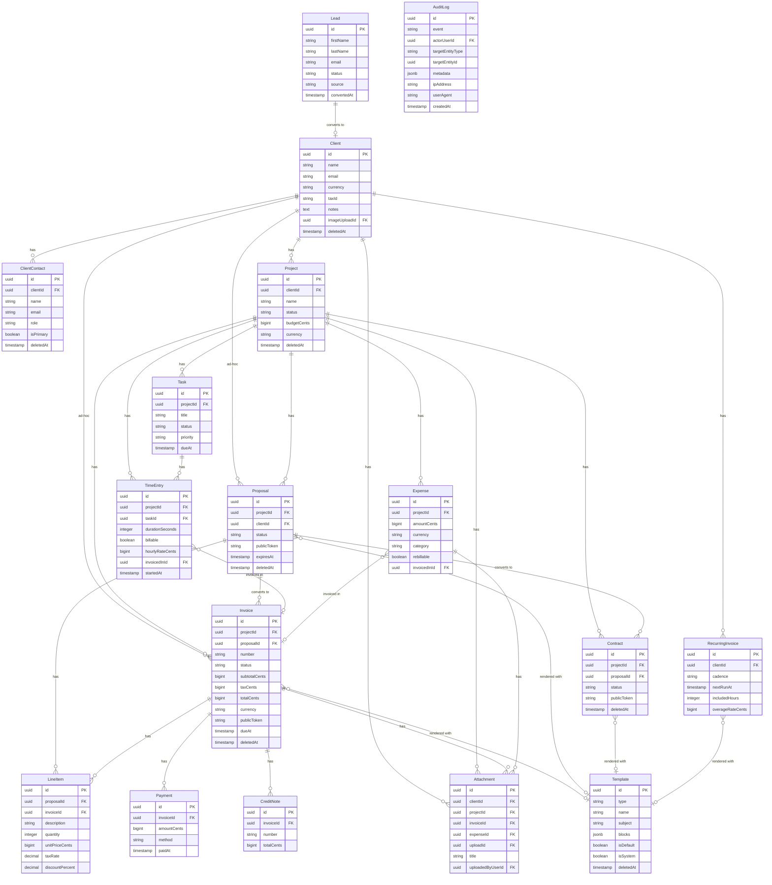

# Remit — Architecture

> This document is the authoritative, forward-looking technical reference for Remit. It describes
> what the system must be, why it is designed that way, and how its parts compose into a coherent
> whole. What is written here is what the code must implement; the implementation follows the
> document, not the other way around. It is written for engineers who want to understand the system
> deeply before contributing, for evaluators reading the codebase as a portfolio artefact, and for
> the author as the canonical record of every significant architectural decision.
>
> Sections are refined in place as decisions evolve; outdated paragraphs are rewritten rather than
> preserved as history. The historical trail lives in git and in the immutable ADR set under
> [Architecture: Architecture Decision Records](#20-architecture-decision-records).
>
> **Scope.** This document covers system architecture and the _why_ behind it. Coding conventions —
> file naming, component patterns, form structure, import order, testing layout — are owned by the
> rule files in `.agents/rules/` and referenced from here, not duplicated. The final database schema
> is owned by `SCHEMA.md` in this directory.

---

## Table of contents

1. [What Remit is](#1-what-remit-is)
2. [Design philosophy](#2-design-philosophy)
3. [Domain model](#3-domain-model)
4. [System architecture](#4-system-architecture)
5. [Module boundaries](#5-module-boundaries)
6. [Business logic layer](#6-business-logic-layer)
7. [Data layer](#7-data-layer)
8. [Event bus](#8-event-bus)
9. [Security architecture](#9-security-architecture)
10. [Multi-user model](#10-multi-user-model)
11. [Frontend architecture](#11-frontend-architecture)
12. [API surface](#12-api-surface)
13. [Infrastructure and deployment](#13-infrastructure-and-deployment)
14. [Self-hosting experience](#14-self-hosting-experience)
15. [Internationalization](#15-internationalization)
16. [Observability](#16-observability)
17. [Testing strategy](#17-testing-strategy)
18. [Hosted offering](#18-hosted-offering)
19. [Open architectural questions](#19-open-architectural-questions)
20. [Architecture Decision Records](#20-architecture-decision-records)

---

## 1. What Remit is

Remit is an open-source, self-hostable business management application for independent freelancers.
It covers the complete money lifecycle of an independent professional: from first contact with a
potential client, through project execution and time tracking, to invoicing, payment collection,
expense management, and end-of-year reporting.

The market is saturated with fragmented SaaS tools. Platforms like Plutio, Bonsai, HoneyBook,
Harvest, Toggl, and Invoice Ninja each solve fragments of this problem. Remit's thesis is that no
single competitor combines all three of the following properties:

**Self-hosted by default.** The user owns the database, the uploaded files, and the email transport.
No vendor can change pricing, lose data, deprecate the product, or access client information without
the user's knowledge.

**Privacy-first by architecture.** Sensitive credentials are encrypted at rest. Email and payment
providers are pluggable and user-selected — they are never forced. The system is designed so that
data covered by an NDA or contractual confidentiality requirement never needs to leave the user's
own infrastructure.

**Single-instance simplicity.** Every domain entity is implicitly owned by the instance. There is no
multi-tenancy in the application code, no per-seat pricing logic in the schema. Multi-user support
exists as a layered addition (owner, accountant, assistant) — see the Multi-user model section — and
never introduces tenant scoping into domain queries. A managed Hosted offering exists alongside
self-hosting, with each customer running on a dedicated isolated instance — see the Hosted offering
section — so that the same simplification holds for both deployment models.

### Primary workflow

```
Lead ──► Client ──► Project ──► Proposal ──► Contract
                       │                         │
                       ├── Time Entries          │
                       ├── Expenses              │
                       └── Tasks                 │
                                ▼                ▼
                             Invoice ◄───────────┘
                                │
                                ├── Payments (manual or Stripe)
                                └── Credit Notes
```

Any subset of this workflow is valid. A user may create invoices directly from a client without a
project, track time without ever billing it, or skip the proposal stage entirely. The system
enforces no required progression — it adapts to the workflow the freelancer actually has.

### What Remit is not

These are explicit out-of-scope areas that define the product's boundaries as much as its features:

- **Not a multi-user team tool.** Collaborative workload balancing, resource allocation, and complex
  permission matrices are out of scope. Light multi-user support (accountant, assistant) is in
  scope; team operations are not.
- **Not a marketplace.** Remit does not help find clients. There is no public profile, bidding, or
  discovery feature.
- **Not a double-entry accounting system.** Remit produces the data that accounting tools consume.
  It does not perform bookkeeping, bank reconciliation, or statutory reporting.
- **Not a project management platform.** Tasks exist to tie work to billing. Remit does not compete
  with Linear, ClickUp, or Notion on project management depth.
- **Not a contact manager.** The people at a client are sub-records of that client
  (`client_contacts`), never a top-level Contact or Person entity. Nothing else in the schema
  references a contact, and no surface navigates to one: they are created, edited, and given the
  primary slot from a tab inside the client workspace. A contact does carry two capabilities over
  its own client's documents — it receives them when it holds the primary slot, and it may accept a
  proposal addressed to that client ([ADR-0027](adr/0027-contact-identity.md)) — but a capability is
  not an entity, and neither one gives a contact a route, a module, or a foreign key pointing at it.

---

## 2. Design philosophy

These principles govern every architectural decision. When two principles conflict, the one higher
in this list takes precedence.

### 1 — Data ownership and privacy are non-negotiable

No feature, integration, or convenience trade-off justifies sending user data through third parties
without explicit, opt-in configuration by the user. This is not aspirational — it is enforced by
architecture: every external dependency (email, payment, error tracking) is an optional adapter that
is disabled until the user provides credentials.

### 2 — Single-instance simplicity is structural

Domain entities carry no `tenantId` foreign key. Ownership is implicit to the instance. Within an
instance, multi-user adds a `role` per user account but does not partition data — every member of
the instance sees the same domain dataset, scoped only by role permissions.

This eliminates an entire class of permission-checking bugs, simplifies every query, and means the
permission model can be understood in two sentences: you own everything in your instance, and your
role decides what you can do with it. The Hosted offering preserves this by isolating each customer
in a dedicated instance — see the Hosted offering section.

### 3 — Modular architecture for a multi-year roadmap

Each feature is a closed module with explicitly enforced boundaries. The codebase is structured as
if it were already a monorepo, so future extraction of packages is mechanical. This constraint
prevents the accretion of hidden cross-feature coupling that makes large codebases impossible to
change safely.

### 4 — Pure business logic, decoupled from infrastructure

Every non-trivial calculation, state transition, and transformation lives in a named pure function
that imports nothing from Next.js, React, Drizzle, or any IO module. This is not just a testing
convenience — it is the foundation for the monorepo future and the guarantee that business logic
never becomes entangled with delivery mechanism.

### 5 — Defer what is not yet certain

When a design decision has two viable paths, choose the one that leaves the most doors open.
Features are added because they make the tool genuinely better for the freelancer's daily work — not
to achieve completeness for its own sake, and not because they might be needed someday.

### 6 — No incomplete code in the main branch

No `TODO` comments as commitments. No stubbed functions. No half-implemented features. The `main`
branch is always deployable. A feature is either done or it lives on a branch.

### 7 — Type safety to every boundary

Every server action, public endpoint, settings field, environment variable, and translation key
validates with Zod or generated types. `any` is forbidden. Non-null assertions are forbidden. The
compiler's guarantees hold all the way from the database schema to the React component.

### 8 — The self-hosting experience is part of the product

Self-hosting operations are product work, not afterthoughts. The architecture target includes
install, upgrade, backup, restore, and disaster recovery. Password-reset recovery, encrypted backup
archives, destructive-safe restores, deterministic demo seeding, encryption-key rotation, and
host-side upgrades, and the background job worker are shipped operational surfaces; the installer
remains planned until backed by code. See the Self-hosting experience section.

---

## 3. Domain model

### Entity relationships


```mermaid
erDiagram
    Lead {
        uuid id PK
        string firstName
        string lastName
        string email
        string status
        string source
        timestamp convertedAt
    }
    Client {
        uuid id PK
        string name
        string email
        string currency
        string taxId
        text notes
        uuid imageUploadId FK
        timestamp deletedAt
    }
    ClientContact {
        uuid id PK
        uuid clientId FK
        string name
        string email
        string role
        boolean isPrimary
        timestamp deletedAt
    }
    Project {
        uuid id PK
        uuid clientId FK
        string name
        string status
        bigint budgetCents
        string currency
        timestamp deletedAt
    }
    Proposal {
        uuid id PK
        uuid projectId FK
        uuid clientId FK
        string status
        string publicToken
        timestamp expiresAt
        timestamp deletedAt
    }
    Contract {
        uuid id PK
        uuid projectId FK
        uuid proposalId FK
        string status
        string publicToken
        timestamp deletedAt
    }
    Invoice {
        uuid id PK
        uuid projectId FK
        uuid proposalId FK
        string number
        string status
        bigint subtotalCents
        bigint taxCents
        bigint totalCents
        string currency
        string publicToken
        timestamp dueAt
        timestamp deletedAt
    }
    LineItem {
        uuid id PK
        uuid proposalId FK
        uuid invoiceId FK
        string description
        integer quantity
        bigint unitPriceCents
        decimal taxRate
        decimal discountPercent
    }
    Payment {
        uuid id PK
        uuid invoiceId FK
        bigint amountCents
        string method
        timestamp paidAt
    }
    TimeEntry {
        uuid id PK
        uuid projectId FK
        uuid taskId FK
        integer durationSeconds
        boolean billable
        bigint hourlyRateCents
        uuid invoicedInId FK
        timestamp startedAt
    }
    Expense {
        uuid id PK
        uuid projectId FK
        bigint amountCents
        string currency
        string category
        boolean rebillable
        uuid invoicedInId FK
    }
    Task {
        uuid id PK
        uuid projectId FK
        string title
        string status
        string priority
        timestamp dueAt
    }
    RecurringInvoice {
        uuid id PK
        uuid clientId FK
        string cadence
        timestamp nextRunAt
        integer includedHours
        bigint overageRateCents
    }
    CreditNote {
        uuid id PK
        uuid invoiceId FK
        string number
        bigint totalCents
    }
    Template {
        uuid id PK
        string type
        string name
        string subject
        jsonb blocks
        boolean isDefault
        boolean isSystem
        timestamp deletedAt
    }
    Attachment {
        uuid id PK
        uuid clientId FK
        uuid projectId FK
        uuid invoiceId FK
        uuid expenseId FK
        uuid uploadId FK
        string title
        uuid uploadedByUserId FK
    }
    AuditLog {
        uuid id PK
        string event
        uuid actorUserId FK
        string targetEntityType
        uuid targetEntityId
        jsonb metadata
        string ipAddress
        string userAgent
        timestamp createdAt
    }

    Lead ||--o| Client : "converts to"
    Client ||--o{ ClientContact : has
    Client ||--o{ Project : has
    Client ||--o{ Invoice : "ad-hoc"
    Client ||--o{ Proposal : "ad-hoc"
    Client ||--o{ RecurringInvoice : has
    Project ||--o{ Proposal : has
    Project ||--o{ Contract : has
    Project ||--o{ Invoice : has
    Project ||--o{ Task : has
    Project ||--o{ TimeEntry : has
    Project ||--o{ Expense : has
    Proposal ||--o{ LineItem : has
    Proposal ||--o{ Invoice : "converts to"
    Proposal ||--o{ Contract : "converts to"
    Invoice ||--o{ LineItem : has
    Invoice ||--o{ Payment : has
    Invoice ||--o{ CreditNote : has
    TimeEntry }o--o| Invoice : "invoiced in"
    Expense }o--o| Invoice : "invoiced in"
    Task ||--o{ TimeEntry : has
    Client ||--o{ Attachment : has
    Project ||--o{ Attachment : has
    Invoice ||--o{ Attachment : has
    Expense ||--o{ Attachment : has
    Invoice }o--o| Template : "rendered with"
    Proposal }o--o| Template : "rendered with"
    Contract }o--o| Template : "rendered with"
    RecurringInvoice }o--o| Template : "rendered with"
```

### Entity lifecycle states

**Invoice**

```
draft ──► sent ──► paid
            │
            ├── (overdue - computed, not stored: dueAt < now AND status = sent)
            └── (partially_paid - computed: sum(payments) < totalCents AND payments exist)
```

**Proposal**

```
draft ──► sent ──► accepted
                ├── rejected
                └── expired (computed: expiresAt < now AND status = sent)
```

**Project**

```
active ──► on_hold
  │
  ├── completed
  └── cancelled
```

**Lead**

```
new ──► contacted ──► qualified ──► proposal_sent ──► won ──► (converted to Client)
                                                   └── lost
```

**Contract**

```
draft ──► sent ──► signed
                ├── expired
                └── terminated
```

**RecurringInvoice**

```
active ──► completed (end condition met: count or date)
```

### Key invariants

- A proposal is immutable after acceptance. Editing an accepted proposal creates an immutable
  historical version; the original is preserved.
- An invoice number, once assigned, is permanent and never reused. The sequence is per-prefix and
  configurable in settings.
- A conversion link is stored once, on the produced document: `invoices.proposalId` and
  `contracts.proposalId`. The proposal carries no mirrored pointer back, so the two sides can never
  disagree.
- Every financial document — proposal, contract, invoice, expense, recurring schedule — hangs off an
  optional project and a client that is required whenever a project is named, and the pair must
  agree: `clientId` is that project's own client. A composite foreign key on
  `(projectId, clientId) → projects (id, clientId)` enforces it, alongside a
  `projectId IS NULL OR clientId IS NOT NULL` check on each table that closes the MATCH SIMPLE hole.
  See [ADR-0026](adr/0026-document-parentage.md).
- A project cannot be re-parented once it carries financial records. `ON UPDATE RESTRICT` on those
  composite keys refuses a `projects.clientId` change while any of them points at the project;
  `features/projects/mutations.ts` refuses it first with a translated message.
- `timeEntries.invoicedInId` and `expenses.invoicedInId` are the canonical "this was billed, on that
  invoice" link, and the one the unbilled partial indexes rely on. `lineItems.sourceTimeEntryId` and
  `lineItems.sourceExpenseId` are optional per-line provenance, not a mirror of it:
  `features/recurringInvoices/jobs.ts` writes the first and not the second, so neither may be
  derived from the other. Nothing enforces this — the flow that would write both does not exist yet.
- `audit_logs` is insert-only. No UPDATE or DELETE operation for this table ever exists at the
  application level.
- Money values are always `bigint` integers representing the smallest currency unit (cents for
  EUR/USD). The ISO 4217 currency code lives on the parent entity, never on individual money
  columns.
- Domain entities carry no `tenantId` foreign key. Ownership is implicit to the instance. The
  single-instance model is structural — see the Design philosophy and Multi-user model sections.
- All domain tables carry `createdAt` and `updatedAt` timestamps (via the `timestamps` helper) and a
  `deletedAt` for soft delete (via the `softDelete` helper).

### Domain model vs. database schema

The domain model in this section is the conceptual reference. It defines entities, relationships,
lifecycles, and invariants. The actual database schema in `database/schema/` implements this model
faithfully and adds operational detail: indexes, check constraints, soft-delete columns, encryption
helpers, polymorphic patterns where pragmatic. The full table-by-table schema specification is in
`SCHEMA.md` in this directory - that is the authoritative reference for column shape, constraints,
and indexes.

A divergence between the domain model and the schema means one of the following:

1. The schema is ahead — a new feature is being implemented and the domain model has not yet been
   updated. The domain model is updated as part of merging the feature.
2. The schema is behind — the domain model describes a planned feature whose schema does not yet
   exist. This is expected; the schema implements only what is built.

A divergence that is neither of the above is a defect and is reconciled before further work
proceeds.

---

## 4. System architecture

### High-level architecture

```
┌────────────────────────────────────────────────────────────────────────────┐
│                           Browser / Client                                │
│              React 19  —  Next.js App Router  —  Tailwind CSS v4         │
└────────────────────────────────────────────────────────────────────────────┘
                    │  RSC + Server Actions          │  Public / anonymous
                    │                                │
  ┌─────────────────────────────┐    ┌──────────────────────────────────────┐
  │      Application Layer      │    │           Public Layer               │
  │   app/(dashboard)/**        │    │   /i/[token]   Invoice view          │
  │   app/(auth)/**             │    │   /p/[token]   Proposal acceptance   │
  │   app/(setup)/**            │    │   /c/[token]   Contract signing      │
  └─────────────────────────────┘    │   /s/[token]   Client portal         │
                 │                   └──────────────────────────────────────┘
                 │ calls
                 │
  ┌─────────────────────────────┐    ┌──────────────────────────────────────┐
  │    Business Logic Layer     │    │            Event Bus                 │
  │  features/*/services/       ├────┤   lib/events/                        │
  │  Pure functions             │    │   Typed, in-process pub/sub          │
  │  No Next / Drizzle / React  │    │   Cross-feature side-effect wiring   │
  └─────────────────────────────┘    └──────────────────────────────────────┘
                 │
                 │
  ┌─────────────────────────────┐    ┌──────────────────────────────────────┐
  │        Data Layer           │    │         External Adapters            │
  │   Drizzle ORM               │    │   Email  - SMTP or Resend            │
  │   PostgreSQL                │    │   Payments - Stripe (or others)      │
  │   database/schema/          │    │   Storage  - local FS or S3          │
  └─────────────────────────────┘    │   Error tracking - Sentry-compatible │
                                     └──────────────────────────────────────┘
```

### Technology stack

| Layer      | Technology                        | Rationale                                                                                                                               |
| ---------- | --------------------------------- | --------------------------------------------------------------------------------------------------------------------------------------- |
| Framework  | Next.js 16 (App Router)           | RSC delivers zero-JS-by-default for read-heavy pages; server actions eliminate a separate API layer for all app writes                  |
| Runtime    | Node.js ≥ 24.11.1 < 25            | Matches the supported runtime declared in `package.json`; provides `crypto.timingSafeEqual` and Web Crypto APIs natively                |
| Language   | TypeScript (strict)               | Type safety enforced to every runtime boundary; `any` and non-null assertions banned                                                    |
| ORM        | Drizzle                           | Thin, type-safe SQL layer; schema-as-code; migrations generated never hand-written                                                      |
| Database   | PostgreSQL                        | ACID guarantees for financial data; JSONB for audit metadata; no extra infrastructure for full-text search                              |
| Auth       | better-auth + organization plugin | TOTP plugin included; sessions; multi-user via the organization plugin (single org per instance) — see the Multi-user model section     |
| Styling    | Tailwind CSS v4                   | Design tokens as CSS variables in `globals.css`; no config file                                                                         |
| Validation | Zod                               | Runtime and compile-time safety at every boundary; single source of truth for input shape and inferred TypeScript types                 |
| Forms      | react-hook-form + zodResolver     | Controlled validation with zero unnecessary re-renders per keystroke                                                                    |
| i18n       | i18next + react-i18next + ICU     | Type-safe message keys derived from a single `Translations` type; ICU for plurals and parameters — see the Internationalization section |
| Logging    | pino                              | Structured JSON in production; one log entry per significant event, with `requestId` correlation                                        |

---

## 5. Module boundaries

### Feature module shape

Every domain feature lives under `features/<feature>/` and is a closed, independently-testable
module. Not every feature needs every file — add only what the feature requires.

```
features/<feature>/
  ├── components/          React UI. Barrel at index.ts.
  ├── hooks/               Feature-scoped hooks.
  ├── services/            Pure business logic. No framework or IO imports.
  │   └── __tests__/       Vitest unit tests. Co-located with what they test.
  ├── engine/              Cohesive runtime spanning services/hooks/components. templates/ only.
  ├── queries.ts           Read operations via Drizzle. Server-only.
  ├── mutations.ts         Write operations (server actions). Server-only.
  ├── schemas.ts           Zod schemas + inferred types.
  ├── labels.ts            Domain values → translation keys, icon names, badge variants.
  ├── types.ts             Public types not derivable from schemas.
  ├── events.ts            Event handler registration for this feature.
  └── index.ts             Public barrel. Only what other features may consume.
```

File-level conventions (component naming, hook naming, import order, type rules) are codified in the
rule files under `.agents/rules/` — see in particular `architecture.md`, `components.md`,
`hooks.md`, `imports.md`, and `types.md`.

### The boundary rule

`features/A` may import from `features/B` only through `features/B/index.ts`. Direct imports between
sibling files inside different features are a violation and are caught by ESLint
(`eslint-plugin-boundaries`).

Types from `database/schema` are the shared data substrate and are exempt from this rule — any
feature may import them directly.

```
✓  import { type Client }    from "@/features/clients"           // barrel
✓  import { type Client }    from "@/database/schema"            // substrate
✗  import { clientSchema }   from "@/features/clients/schemas"   // sibling file
```

### Why closed modules

This constraint produces four concrete benefits:

**Refactoring safety.** Changing internals in `features/B` cannot silently break `features/A` as
long as the barrel contract is maintained. The compiler enforces the boundary.

**Testability.** Each module's `services/` can be tested in complete isolation with no mocking of
other features, no database, and no framework.

**Discoverability.** A new contributor reads `index.ts` and understands the public contract of a
feature in one file.

**Monorepo readiness.** When the project grows a second artefact — a CLI tool, a plugin SDK, a
documentation site — each feature is ready for extraction into `packages/<feature>` with mechanical
changes only. The boundary enforcement means no hidden coupling to unwind.

### Feature inventory

The full feature inventory and its planned extensions are documented in the project's roadmap.
Active features at any given time are reflected by the directories present in `features/` and by the
relations declared in `database/schema/`.

---

## 6. Business logic layer

### The services pattern

Every non-trivial computation lives in a named pure function inside `features/<feature>/services/`.
"Pure" means: no imports from `next/*`, `react`, `drizzle-orm/*`, `@/database`, or any module that
performs IO. The function receives its inputs as arguments and returns its output as a return value.

Representative examples by feature:

```
features/invoicing/services/
  calculateInvoiceTotal.ts       — tax + discount arithmetic on line items
  generateInvoiceNumber.ts       — sequence generation given prefix and last number
  canTransitionInvoiceStatus.ts  — status transition guard, returns { allowed, reason }

features/proposals/services/
  isProposalExpired.ts           — expiresAt vs. a given Date
  canTransitionProposalStatus.ts — transition guard

features/timeTracking/services/
  aggregateBillableHours.ts      — sum billable seconds, convert to hours
  resolveHourlyRate.ts           — rate precedence: entry → task → project → client → default
  computeInvoiceableEntries.ts   — filter + group unbilled entries for invoice line item generation

features/recurring/services/
  computeNextRunDate.ts          — next date from cadence + last run date
  shouldGenerateInvoice.ts       — whether a schedule is due as of a given date
```

### Why pure functions here

**Millisecond-level test feedback.** A full `services/` test suite runs without any network call,
database connection, or module mock. The test cold-start is unmeasurable.

**Refactor confidence.** When upgrading Drizzle, replacing the ORM, or migrating to a different
runtime environment, `services/` is entirely unaffected. The blast radius of infrastructure changes
is confined to the thin orchestration layer.

**Auditability.** Pure functions are easy to read and reason about in isolation. A code reviewer
does not need to understand the database schema or the request lifecycle to verify that a tax
calculation is correct.

**Future monorepo.** When a CLI tool, a worker process, or a plugin SDK needs the same business
logic, `services/` extracts to `packages/core` with no architectural change — only a move.

### Server actions as thin orchestrators

Server actions in `mutations.ts` follow a strict four-step pattern with no exceptions:

```
1. Validate      → safeParse with the feature's Zod schema. Return { error } on failure.
2. Compute       → call into services/ for any branching logic.
3. Persist       → Drizzle writes, wrapped in try/catch. Map known DB errors to friendly strings.
4. Side-effects  → emit event bus event; revalidatePath/revalidateTag; write audit log if needed.
```

They return `{ data: T } | { error: string }` and never throw to the caller. The full canonical
pattern, including audit logging, event emission, and revalidation rules, is documented in
`actions.md`.

### Queries as typed read operations

Read functions in `queries.ts` use Drizzle's relational query API or raw SQL for complex
aggregations. They return typed results and perform no write operations. They are the only place in
the codebase where Drizzle reads are performed outside of server actions.

---

## 7. Data layer

### Schema organisation

One Drizzle schema file per domain entity in `database/schema/`. All schemas exported via
`database/schema/index.ts`. Generated migrations live in `drizzle/migrations/` and are never
hand-edited — the migration file is an artefact, not source code.

The full final schema specification — every table, column, constraint, index — is in `SCHEMA.md` in
this directory.

### Universal table conventions

| Convention       | Rule                                                                    | Rationale                                                                       |
| ---------------- | ----------------------------------------------------------------------- | ------------------------------------------------------------------------------- |
| Primary key      | `uuid` with `.defaultRandom()`                                          | No sequential ID leakage; safe to reference in public URLs before insertion     |
| Timestamps       | Spread `timestamps` from `database/schema/helpers.ts`                   | Consistency; `createdAt` and `updatedAt` on every table without repetition      |
| Timestamp type   | `{ withTimezone: true, mode: "date" }`                                  | Correct timezone handling; `Date` type in TypeScript                            |
| Foreign keys     | `{ onDelete: "cascade" }` by default                                    | Prevents orphaned records; explicit exception required for non-cascade cases    |
| Soft delete      | `deletedAt` via the `softDelete` helper                                 | Data is restorable; financial records survive deletion for legal retention      |
| Money            | `bigint` storing integer minor units                                    | No floating-point rounding; exact arithmetic for all financial calculations     |
| Currency         | `varchar(3)` on the parent entity                                       | ISO 4217 code (e.g., `"EUR"`) stored once, not duplicated on every money column |
| Encrypted fields | `encryptedColumn()` Drizzle helper                                      | Transparent AES-256-GCM; no plaintext secrets in the database                   |
| Indexes          | Explicit for every FK used in joins and every `WHERE`/`ORDER BY` column | Prevents table scans on foreign key joins in a growing dataset                  |

Detailed conventions for schema files, including index declaration syntax and money formatting
rules, live in `database.md`.

### Money storage in depth

Floating-point types (`real`, `double precision`) accumulate rounding errors in financial
calculations. `10.00 * 0.23` can produce `2.3000000000000003` in IEEE 754 arithmetic. Storing money
as integer minor units eliminates this entire class of bug. For EUR, `1000` minor units is always
`€10.00`. Arithmetic on minor units is exact integer arithmetic. See ADR-0009.

Display formatting always uses `Intl.NumberFormat` with the entity's currency code:

```ts
new Intl.NumberFormat("pt-PT", {
  style: "currency",
  currency: invoice.currency
}).format(invoice.totalCents / 100)
```

### The `encryptedColumn()` helper

Fields that contain sensitive credentials are defined in the Drizzle schema using
`encryptedColumn()` from `database/schema/helpers.ts`. The helper provides:

- **Transparent encryption on write** using AES-256-GCM with a per-row random IV generated at write
  time.
- **Transparent decryption on read** - consuming code receives the plaintext value and is unaware of
  the encryption.
- The master key is loaded from `REMIT_ENCRYPTION_KEY` (a base64-encoded 32-byte key generated at
  install time by the install script).

**Loss of the encryption key means permanent, unrecoverable loss of these fields.** This is the
price of self-hosting and is documented prominently in the installation guide and setup wizard. See
ADR-0005.

### Migrations strategy

Drizzle migrations are forward-compatible. Breaking schema changes are split across two releases:
release N adds the new column as nullable; release N+1 backfills and adds the `NOT NULL` constraint.
This ensures that any running instance can be upgraded without a maintenance window.

The history before v1 is squashed into one baseline: `0000_initial_schema.sql` is the whole schema
as generated by `pnpm database:generate`, and it is followed by exactly two hand-written migrations,
which exist because Drizzle cannot express what they contain — `0001_insert_only_guards.sql` (the
insert-only triggers on `audit_logs` and `contract_signatures`) and
`0002_document_parent_agreement.sql` (the five composite parent foreign keys of
[ADR-0026](adr/0026-document-parentage.md)). The baseline has been regenerated twice, most recently
when attachments landed; each regeneration re-created those two files unchanged after it.

A squash **invalidates every existing database**. There is no upgrade path across one: a developer
or deployment holding the old history has to reset, because the replay is keyed by hash and the old
hashes no longer exist. It is safe only while v1 has not shipped, and it stops being available the
moment it has — from the first release onwards, migrations are only ever appended.

---

## 8. Event bus

### Purpose

Cross-feature side effects are mediated by a typed, in-process event bus at `lib/events/`.

Without the bus, an action like `markInvoicePaid` must directly invoke every feature that needs to
react: write an activity log entry, write an audit log entry, invalidate the dashboard cache, send a
payment receipt email, and check whether all project invoices are now paid. Each new consumer
requires modifying the action, which violates the closed module boundary and makes the action
increasingly hard to test.

With the bus, `markInvoicePaid` emits `invoice.paid` once. Each feature registers its own handler in
`features/<feature>/events.ts` and owns its reaction entirely. See ADR-0006.

### Event naming convention

```
<entity>.<past_tense_verb>

invoice.created        invoice.sent           invoice.paid
invoice.overdue        invoice.reminder_sent  invoice.partially_paid
proposal.sent          proposal.accepted      proposal.rejected       proposal.expired
contract.sent          contract.signed        contract.expired
time.logged            time.invoiced
expense.created        expense.invoiced
payment.received
client.created         client.updated         client.deleted
lead.converted         lead.stage_changed
auth.login.succeeded   auth.login.failed      auth.password.changed
auth.totp.reconfigured auth.backup_code.consumed
settings.email.configured  settings.payment.configured  settings.security.changed
recurring.invoice_generated  retainer.pool_exhausted
member.invited         member.accepted        member.removed         invitation.canceled
```

### `invoice.paid` fan-out as a concrete example

```
emit("invoice.paid", { invoiceId })
  ├── features/activityLog/events.ts   — writes "Invoice #INV-042 marked as paid"
  ├── features/audit/events.ts         — writes security audit entry
  ├── features/dashboard/events.ts     — revalidates dashboard KPI cache tags
  ├── features/email/events.ts         — sends payment receipt if SMTP is configured
  └── features/projects/events.ts      — checks if all project invoices are paid;
                                          suggests marking project as completed
```

Each handler is owned by its feature. Adding a new consumer requires no change to the
`markInvoicePaid` action.

### Bus properties

| Property    | Value                                         | Rationale                                                                                 |
| ----------- | --------------------------------------------- | ----------------------------------------------------------------------------------------- |
| Type safety | Strongly typed event map                      | Adding an event requires extending the map; handlers are type-checked against the payload |
| Execution   | Synchronous; async handlers awaited in series | Handler failures surface as action errors; no silent background failures                  |
| Topology    | In-process, no broker                         | Correct for single-instance deployment; extractable to a queue when load demands it       |

---

## 9. Security architecture

Security is a first-class feature. The goal is "demonstrably defensible" as a portfolio artefact and
"actually safe" in production self-hosted use.

### Authentication flow

```
POST /login
  │
  ├── Rate limiter check (in-memory or Redis adapter)
  │
  ├── better-auth credential verification
  │     ├── Failure → emit auth.login.failed → audit log (IP, user-agent, timestamp)
  │     └── Success → continue
  │
  ├── TOTP verification (mandatory, no bypass)
  │     ├── Failure → audit log
  │     └── Success → continue
  │
  ├── Session created (httpOnly, secure, sameSite: lax)
  │     └── activeOrganizationId set on session (always the instance organization)
  │
  └── emit auth.login.succeeded → audit log
```

### Better Auth ownership

Better Auth is the source of truth for authentication-owned state: user credentials, sessions,
password hashing and reset tokens, email verification and change-email verification, TOTP secrets,
backup codes, organizations, memberships, active organization state, invitations, and member roles.
Runtime code manipulates that state through Better Auth APIs, client methods, and helpers. Direct
writes to Better Auth-owned tables are allowed only in generated migrations and explicit operational
recovery scripts.

Remit-owned auth-adjacent fields may still be maintained by Remit code. For example,
`users.mustChangePassword` is an application recovery flag used by the password reset CLI, but the
credential password hash and session lifecycle remain Better Auth-owned.

### Password reset paths

Two coexisting paths, in order of availability:

1. **Email reset link** - available when the configured SMTP or Resend transport is complete. Better
   Auth generates the token and owns the reset flow; Remit only delivers the email.

2. **CLI/admin reset** - `docker compose exec app pnpm remit:reset-password` for self-hosted
   complete-lockout cases or environments without email transport. This is an explicit operational
   recovery script: it generates a temporary password with Better Auth's password hasher, marks the
   user `mustChangePassword`, and writes an audit log entry.

TOTP is **never optional**. There is no UI to disable it. Password reset and second-factor fallback
are separate concerns: password reset happens through Better Auth email/password APIs or the
operational CLI fallback, while second-factor fallback uses Better Auth backup codes.

Better Auth **backup codes** remain enabled as part of the TOTP plugin and are stored in
`two_factors.backup_codes`. They are used only as a second-factor fallback during login when the
authenticator app is unavailable.

### Encryption at rest

| Field                          | Encryption rationale                              |
| ------------------------------ | ------------------------------------------------- |
| `settings.smtpPass`            | SMTP server credential                            |
| `settings.resendApiKey`        | Resend API key                                    |
| `settings.stripeSecretKey`     | Stripe secret key                                 |
| `settings.stripeWebhookSecret` | Stripe webhook signing secret                     |
| `settings.paymentIban`         | Sensitive banking identifier                      |
| `settings.backupS3AccessKey`   | S3-compatible backup access key                   |
| `settings.backupS3SecretKey`   | S3-compatible backup secret key                   |
| `clients.notes`                | May contain NDA-protected or confidential content |

### The two audit logs

Two logs serve distinct purposes and must never be confused:

**Activity log** (`activity_logs`) - user-facing, friendly messages ("Invoice #INV-042 sent to Acme
Corp"), can be edited or deleted via the UI, used for "what happened this week" and client-facing
event summaries.

**Audit log** (`audit_logs`) - security-facing, append-only, immutable. No UI to delete entries.
Schema: `id`, `event`, `actorUserId | null`, `targetEntityType | null`, `targetEntityId | null`,
`metadata jsonb`, `ipAddress`, `userAgent`, `createdAt`. No `updatedAt`, no `deletedAt`. Captures:
login success/failure; password change; TOTP setup, reconfiguration; Better Auth backup-code
consumption; CLI/admin password resets; settings changes touching SMTP, Stripe, or payment
information; data exports; entity deletions; public token rotations; member changes (see the
Multi-user model section); backup and restore operations.

### Public token security

Tokens for document sharing (`/i/[token]`, `/p/[token]`, `/c/[token]`, `/s/[token]`) are:

- Generated with `crypto.randomBytes(32).toString("base64url")` — 256 bits of entropy.
- Compared with `crypto.timingSafeEqual` to prevent timing-based token enumeration.
- On token miss, the response shape and approximate response time match a "valid token, document
  archived" case to defeat enumeration via timing.
- Revocable and rotatable without losing the underlying document.
- All public token pages set `X-Robots-Tag: noindex, nofollow` and
  `<meta name="robots" content="noindex,nofollow">`.

### Private files and attachments

`uploads.bucket` splits stored objects in two. The `public` bucket holds what a browser may fetch
directly — avatars, the business logo, a client's image, template images — and its keys are turned
into URLs by `resolveStorageUrl`. The `documents` bucket holds everything else and has no anonymous
read policy; handing one of its keys to `resolveStorageUrl` is a bug, because the helper would build
a URL the bucket refuses while telling the caller the object is reachable.

Every attachment lands in `documents` and is served only by `app/api/attachments/[id]/route.ts`,
which checks the session before it reads anything and streams the object through the app rather than
redirecting to storage. No attachment is reachable from a public token route in v1, which is also
why proposals and contracts — the two entities a client can open anonymously — are not attachable:
there, every attached file would be an exposure decision rather than a storage one.

Authorization comes from the parent record, never from `uploads`, which carries no owner column.
`chk_attachments_parent` guarantees an attachment names exactly one parent, so "may this requester
touch this file" is always the already-answered question "may this requester touch that record".
[ADR-0028](adr/0028-attachments-and-visual-identity.md) records the shape and its alternatives.

### Rate limiting

A rate limiter with a swappable adapter (in-memory by default; Redis for multi-instance deploys)
protects every endpoint that processes authentication or a public token. Protected endpoints:
`POST /login`, `POST /register`, `/i/[token]`, `/p/[token]`, password reset requests, and all
`/api/*` routes with a per-IP backstop.

Limits are sane defaults configurable in settings.

### HTTP security headers

Set in middleware for every response:

| Header                      | Value                                                              |
| --------------------------- | ------------------------------------------------------------------ |
| `Strict-Transport-Security` | `max-age=63072000; includeSubDomains; preload` (production)        |
| `Content-Security-Policy`   | Strict with explicit allowlists for third-party assets             |
| `X-Frame-Options`           | `DENY` on all pages except those that explicitly require embedding |
| `X-Content-Type-Options`    | `nosniff`                                                          |
| `Referrer-Policy`           | `strict-origin-when-cross-origin`                                  |
| `Permissions-Policy`        | `camera=(), microphone=(), geolocation=()`                         |

Session cookies: `httpOnly: true`, `secure: true` (production), `sameSite: "lax"`. The application
refuses to start in production mode without HTTPS.

### Routing state rule

Authentication and onboarding state is derived exclusively from the database and the active session.
No routing decisions are stored in cookies. The middleware enforces a strict state machine:

```
No user record in DB             → redirect to /register
No active session                → redirect to /login
Business profile incomplete      → redirect to /setup (business step)
TOTP not enrolled                → redirect to /setup (TOTP step)
All conditions satisfied         → allow to (dashboard)
```

This rule is non-negotiable. Adding a cookie to influence routing is a violation. See ADR-0001.

### Data export and deletion

Two GDPR-aligned features:

**Export.** `/settings/data` produces a zip containing JSON of every entity, every uploaded file,
and every generated PDF. Audit-logged. Per-client export is also available for client offboarding or
right-to-portability requests.

The surface is owner-only (`requireRole("owner")` on the page, `requireDataExportWrite` in the
mutation, and a role check in the download route). A request enqueues the `data_export.assemble` job
(ADR-0023); the worker reads the rows, streams every referenced storage object into a zip, uploads
it, and reports `status`/`progress` on the `data_exports` row, which the page polls. Archives are
stored in a **separate exports bucket with no anonymous read policy** — unlike the runtime uploads
bucket — so `GET /api/exports/[id]` is the only path out.

Three audit entries cover an export's life: `data_export.requested` (actor, role, scope, client id,
IP, user-agent), `data_export.completed` or `data_export.failed` from the worker (no request
context, so no IP), and `data_export.downloaded` when the bytes actually leave.

The archive layout is `index.json`, one `data/<table>.json` per exported table, and the stored
objects under `files/<storage key>`. `index.json` carries the exclusion list, so a recipient can
tell a policy omission from a missing file.

`features/dataExport/services/exportManifest.ts` is the authoritative inclusion list — an allowlist
of table **and column**, enforced at the SELECT, with a test that fails when a new schema column is
neither included nor explicitly excluded. Policy:

Included:

- Business records: `clients` (including the encrypted `notes`, decrypted), `leads`, `projects`,
  `tasks`, `time_entries`, `expenses`, `proposals`, `contracts`, `contract_signatures`,
  `recurring_invoices`, `invoices`, `line_items`, `payments`, `credit_notes`.
- `settings` business identity, locale and document-numbering columns, plus `payment_bank_name` and
  `payment_instructions`.
- `templates`, `tax_rates`, `activity_logs`, `audit_logs`, `uploads`, `data_exports` — instance
  scope only.
- Every `uploads` object's bytes, which is also how ADR-0022 PDFs travel once they are stored as
  uploads.
- Soft-deleted rows, with `deleted_at` intact, because they still exist in the instance.

Excluded:

- Public bearer tokens everywhere: `invoices.public_token`, `proposals.public_token`,
  `contracts.public_token`, `clients.portal_token`.
- The whole `settings` email, payment-provider and backup configuration surface — every
  `encryptedColumn()` (SMTP password, Resend key, Stripe secret and webhook secret, backup S3 keys,
  `payment_iban`) **and** its non-secret halves such as `smtp_host` and `stripe_publishable_key`.
- Every Better Auth-owned table: `users`, `sessions`, `accounts`, `verifications`, `two_factors`,
  `organizations`, `members`, `invitations`.
- `proposal_otps` — single-use acceptance codes.
- `data_exports.storage_key`, an internal object path.

Two boundaries are deliberately wider than "everything the owner may see". The whole configuration
surface is excluded rather than filtered field by field, because one auditable boundary does not
grow a new leak each time a provider setting is added beside a secret; and the Better Auth boundary
is drawn around the plugin's entire schema rather than around its credential columns, because those
tables' shape is owned by a dependency that changes across upgrades. A client-scoped export drops
the instance-wide files (`settings`, `templates`, `tax_rates`, `audit_logs`) and scopes everything
else to that client's subgraph.

**Soft delete and retention.** Domain entities use `deletedAt` for soft delete and are restorable
from a trash view. Hard delete is available after a configurable retention period. Hard-deleting a
client cascades to projects, proposals, and invoices in soft-delete state and requires typed-name
confirmation.

---

## 10. Multi-user model

### Why this section exists

The single-instance simplicity in see the Design philosophy section is structural: every domain
entity is owned by the instance, and there is no `tenantId` foreign key on domain tables. This
section explains how to layer light multi-user access — accountant access, an assistant — on top of
this base model **without introducing tenant scoping into domain queries**.

### The roles

Three roles, defined statically and never extended through configuration:

| Role         | Permissions                                                                                     |
| ------------ | ----------------------------------------------------------------------------------------------- |
| `owner`      | Everything. Exactly one per instance. The account created during `/register` and `/setup`.      |
| `accountant` | Read access to all entities. Can export data. Cannot create, update, send, delete, or transmit. |
| `assistant`  | Can create and edit drafts. Cannot send, mark as paid, delete, or change settings.              |

The owner is permanent and structural — it is the instance owner. Other roles are invitations, not
seats.

### Implementation: Better Auth organization plugin

Multi-user is implemented via the Better Auth organization plugin, with **a single organization per
Remit instance**. The organization is created automatically during `/setup` through Better Auth's
organization API (named after the business profile), the first setup user becomes `owner`, and the
active organization is set through Better Auth. Every authenticated user is a member of that one
organization. The session always carries an `activeOrganizationId` and it is always that one
organization.

This deliberately uses the plugin in single-organization mode - multi-org-per-user is not exercised,
because a Remit instance is a single business. The benefit is inheriting the plugin's invitation
flow, role propagation, active organization state, active member role, and member tables for free,
while keeping the conceptual model trivial.

The installed Better Auth version is the schema contract for these tables. Remit customizes the
allowed business roles at the plugin boundary, but it does **not** invent a parallel schema for the
plugin-owned tables. Runtime code creates organizations, activates organizations, manages
memberships, changes roles, and sends invitations through Better Auth organization APIs. If Better
Auth expects `text` role/status fields, a required `slug`, or a session-level
`activeOrganizationId`, the Remit schema mirrors that exactly.

The plugin contributes the following tables to the schema:

- `organization` - exactly one row per instance, with a required unique `slug`. `metadata` follows
  Better Auth's storage contract for the installed version.
- `member` - maps `(userId, organizationId, role)`. `role` is stored in the plugin-compatible column
  shape and Remit constrains allowed values to `owner | accountant | assistant`.
- `invitation` - pending invitations with email, role, expiry, inviter, and Better Auth's status
  lifecycle (`pending | accepted | rejected | canceled` for the current version).

Domain tables remain free of `tenantId` foreign keys, queries do not change, and ownership remains
implicit to the instance. See ADR-0013.

### Authorization model

Authorization is implemented as a thin layer in two places:

**Middleware-level (route gating).** Routes under `/settings/security`, `/settings/team`,
`/settings/system`, `/settings/api`, and any endpoint that exposes the encryption key fingerprint
are owner-only. Routes that perform sends or deletions are blocked for `assistant`. All other routes
are accessible to all roles.

**Action-level (operation gating).** Every server action gates on the active member's role before it
writes. Both helpers live in `lib/auth/session.ts`, and which one a call site uses is determined by
what that call site is allowed to do when the check fails:

- **Route and RSC gating uses `requireRole`.** It redirects to `/login` without a session and calls
  `notFound()` on an insufficient role, so an unauthorized role cannot use the response to learn
  that the route exists.
- **Server actions use `getCurrentRole` and an explicit comparison.** An action must return
  `{ data } | { error }` and must never throw to the client, so it cannot call `requireRole` —
  `notFound()` inside an action would escape the contract every caller branches on.

```ts
"use server"

import { getCurrentRole } from "@/lib/auth/session"

const role = await getCurrentRole({ headers: requestHeaders, userId: session.user.id })

if (role !== "owner") return { error: t("errors.forbidden") }
```

Features with several gates name them rather than repeating the comparison — `requireInvoiceRole`,
`requireContractRole`, `requirePaymentRole` and their siblings in each feature's
`mutationContext.ts` wrap one implementation behind names that state the operation's policy (an
assistant may draft and revise an invoice; recording that money arrived is the accountant's job as
much as the owner's).

`getCurrentRole` delegates role lookup to Better Auth's active member role for the active
organization. It does not silently create organizations, repair memberships, or infer roles from
Remit-owned tables; a user with no membership resolves to `null`, which every gate refuses. Audit
log entries always include the actor's user id and role.

**Read gating follows write gating.** A settings surface whose actions are owner-only also guards
its page with `requireRole("owner")`. The settings rail hides links by role, but navigation
visibility is never the authorization — each page refuses the URL on its own.

### Invitation flow

Implemented in `features/team`. Every organization write goes through a Better Auth organization
API; nothing in the feature inserts, updates, or deletes `organizations`, `members`, or
`invitations` directly.

1. Owner invites an email address with a role from `/settings/team`, guarded by
   `requireRole("owner")` on the page and an owner comparison in every mutation.
   `auth.api.createInvitation` writes the `invitation` row.
2. If email delivery is configured, Remit sends the invitation and records it in `email_logs`.
   Otherwise the owner is shown a one-time link to `/invite/[invitationId]` to share manually. The
   invitation id is the bearer credential for that link, so it is never written to `audit_logs`, to
   an event payload, or to a log line.
3. Invitee opens the link and `auth.api.acceptInvitation` activates the `member` row. The page
   resolves which of its shapes to render server-side: sign up when the address has no account,
   accept when the session is already the invitee's, sign out when it belongs to somebody else, and
   sign in when the address has an account but no session. That last shape is not hypothetical —
   removing a member deletes the membership and leaves the `users` row, so re-inviting a removed
   address always reaches somebody who cannot register. `proxy.ts` lets `/invite/...` through ahead
   of its other guards — an invitee has no session yet, and immediately after signing up has one
   that is not setup-complete — under its own rate limit.
4. The invitee enrolls TOTP - mandatory for all roles, no exceptions. Nothing in the acceptance path
   redirects past `/setup`; it returns the invitee to `/` and lets the proxy's state machine route
   them.

Only `accountant` and `assistant` are invitable or assignable, which is what keeps a second owner
unreachable from this surface; `uq_member_owner_per_org` remains the structural backstop, and Better
Auth independently refuses to leave the organization without an owner.

Owners can remove memberships at any time. Removal invalidates all sessions for that user through
Better Auth's internal adapter (`deleteUserSessions`), because the plugin exposes no endpoint that
revokes another user's sessions without the admin plugin. Revocation failure is reported to the
owner rather than rolled back: the membership is already gone, so every gate refuses the removed
user regardless.

### What multi-user does not change

- The domain model has no `tenantId` foreign keys. Adding one is a violation.
- The single-instance model is the base; multi-user is layered on top via role assignment and the
  gates described above.
- The audit log captures the actor user id and role but never alters what gets recorded — the audit
  log is not a permission system.
- All roles must enroll TOTP through the same `/setup` flow. Backup codes are generated and shown as
  part of the Better Auth TOTP flow; password recovery remains email- or CLI/admin-based.

See ADR-0002 (single-instance model is structural) — multi-user does not supersede it; it extends
it. See ADR-0013 (Better Auth organization plugin chosen).

---

## 11. Frontend architecture

### React Server Components by default

Pages and layouts are React Server Components (RSC) by default. `"use client"` is added only when
the component requires browser APIs, event listeners, or React hooks. The result is minimal
JavaScript shipped to the browser for read-heavy pages — invoice lists, client detail, the dashboard

- while interactive components remain fully reactive.

### Component hierarchy

```
app/(dashboard)/invoices/page.tsx       Server component - fetches, composes
  └── features/invoicing/components/
        ├── InvoiceList.tsx              Server component - renders table
        ├── InvoiceFilters.tsx           Client component - search, filter UI
        └── InvoiceActions/
              ├── InvoiceActions.tsx     Client component - send, mark paid, delete
              └── DeleteInvoiceDialog.tsx  Client component - confirmation dialog
                    └── components/ui/   Shared primitives (shadcn + Radix UI)
```

Component-level conventions — file naming, decomposition rules, the `Typography` and `Icon`
primitives, the `data-slot` attribute — are codified in `components.md`.

### Forms

All forms use `react-hook-form` with `zodResolver` and a `Controller` per field. Field-level errors
surface through `FieldError`; submit-level errors render in a `FieldError` above the submit button.
The full pattern (modes, validation, accessibility attributes, server error surfacing) is documented
in `forms.md`.

### State management

There is no global client-side state library. State lives in the closest reasonable place:

| State kind                   | Location                                   |
| ---------------------------- | ------------------------------------------ |
| Server data                  | RSC / Next.js route cache                  |
| Form state                   | react-hook-form                            |
| Dialog and UI state          | `useState` in the owning component         |
| Cross-component coordination | React context, scoped to the feature       |
| URL-derived state            | `useSearchParams` / `usePathname`          |
| Ephemeral gesture state      | Refs in a feature-scoped interaction store |

Ephemeral gesture state is the shape a continuous direct-manipulation surface needs: the template
editor's `useEditorInteraction` keeps in-flight geometry in refs, publishes it through a
subscription, and writes each frame's transforms imperatively to registered DOM nodes, committing to
the document store exactly once at `pointerup` as one undo entry — a per-frame document commit would
be the defect, not the design. See [ADR-0024](adr/0024-template-editor-canvas.md) for the canvas
engine.

### Design system

All standalone text uses the `Typography` component — never raw `<p>`, `<span>`, or heading elements
outside of a primitive's own implementation. All icons use `<Icon name="..." />` — never direct
imports from `lucide-react`. All design tokens (colours, radius, spacing) are CSS variables in
`app/globals.css`; there is no `tailwind.config.js`.

Before writing any visual UI, `components/ui/index.ts` is checked for an existing primitive. New UI
work never reimplements a concept that already exists in the design system.

### Accessibility

Accessibility is non-negotiable. Every interactive element is a semantic button, link, or input;
icons that convey meaning carry an accessible name; color is never the sole signal; focus is always
visible; modals trap focus. Full conventions in `accessibility.md`.

---

## 12. API surface

### Server actions vs. API routes

Server actions in `features/<feature>/mutations.ts` are the canonical write path for all
application-level interactions. API routes exist only for specific, justified cases:

| Route                  | Purpose                                                        |
| ---------------------- | -------------------------------------------------------------- |
| `/i/[token]`           | Public invoice view (anonymous)                                |
| `/p/[token]`           | Public proposal acceptance (anonymous + OTP)                   |
| `/c/[token]`           | Public contract signing (anonymous)                            |
| `/s/[token]`           | Client portal (anonymous, read-only)                           |
| `/api/webhooks/stripe` | Stripe webhook event receiver                                  |
| `/api/health`          | Uptime monitor health check (public)                           |
| `/api/metrics`         | Reserved Prometheus metrics endpoint (opt-in, token-protected) |

### Public API

A REST API mirroring the server actions, with scoped API tokens managed in `/settings/api` and
outbound webhooks configurable per event in `/settings/webhooks`. Documentation auto-generated from
Zod schemas via `zod-openapi`.

### Validation at every boundary

```
Browser input  ──►  Zod schema in features/*/schemas.ts   ──►  server action
URL params     ──►  Zod schema in the route handler        ──►  query function
Env vars       ──►  Zod schema in lib/config/env.ts        ──►  process fails fast at boot
Settings read  ──►  Zod schema on read and write           ──►  defensive against old data
```

No data crosses a boundary unvalidated.

---

## 13. Infrastructure and deployment

### Docker-first deployment model

The primary deployment unit is a Docker image published to GitHub Container Registry (GHCR). A
`docker-compose.yml` bundles the application and a PostgreSQL container. Two Compose profiles:

- **Default profile** — exposes a configurable port; assumes an existing reverse proxy (Nginx,
  Caddy, Traefik, Cloudflare Tunnel).
- **`with-proxy` profile** — includes Caddy with automatic Let's Encrypt TLS. One command, full
  HTTPS, zero certificate management.

### Configuration hierarchy

```
lib/config/env.ts    Zod-validated deployment configuration. Process exits on failure.
/setup wizard        First-run UI configuration. Minimal - see the Self-hosting experience section.
/settings/**         Ongoing instance configuration stored in the settings table.
.env                 Deployment-owned configuration: database URL, auth URL/secret, encryption key,
                     data/storage bootstrap, Hosted mode, optional Sentry DSN, optional metrics token.
```

No feature reads `process.env` directly. All environment access is through `lib/config/env.ts`.
Environment variables are for boot-time and operator-owned infrastructure concerns. Settings are for
instance behavior that an owner can reasonably manage through the product UI, such as SMTP/Resend,
Stripe, bank-transfer details, invoice defaults, backup policy, and template customization.

### Data residency

All data is stored in the PostgreSQL instance owned and operated by the user. No analytics,
telemetry, or usage data leaves the instance without explicit configuration. Error tracking is
opt-in through `SENTRY_DSN`; future update checks remain opt-in.

---

## 14. Self-hosting experience

The biggest friction in adopting a self-hosted application is not the feature set; it is install,
upgrade, backup, and recover. Remit treats each of these as first-class product concerns. The
architecture defines the boundaries and safety model; focused operations and specification documents
carry the command-level detail.

Current implementation status: the repository ships Docker Compose files, an entrypoint migration
script, the `/settings/system` health surface, `pnpm remit:reset-password` for credential recovery,
`pnpm remit:backup` for encrypted local, S3, R2, and B2 backup archives, `pnpm remit:restore` for
destructive-safe local and remote restores, `pnpm remit:seed-demo` for deterministic local/demo
data, `pnpm remit:reset-data` for returning a demoed instance to zero domain data without losing the
account or its configuration, `pnpm remit:rotate-encryption-key` for operational master-key
rotation, and the host-side `scripts/host/upgrade.sh` upgrade flow documented in
[`docs/operations/UPGRADE.md`](../operations/UPGRADE.md). The one-command installer, scheduled
backup job, and platform-specific deployment guides remain planned operational work and are not
shipped as package scripts today.

The deeper self-hosting references are:

- [Operational CLI contract](operations/CLI-CONTRACT.md) for command naming, execution context,
  packaging, validation, status, and the explicit `remit:upgrade` exception.
- [Backup archive format](specs/BACKUP-ARCHIVE.md) for the `.remitbak` byte layout, manifest,
  encryption, destination, compatibility, and backup audit contract.
- [Restore runbook](../operations/RESTORE.md) for destructive restore safety, confirmation, refusal
  rules, data effects, and logging/redaction.
- [Upgrade runbook](../operations/UPGRADE.md) for host-side upgrade prerequisites, execution,
  rollback, and troubleshooting.
- [ADR-0021](adr/0021-encryption-key-rotation.md) for encryption key rotation semantics,
  recoverability, audit events, and refusal rules.

### Planned one-command install

The target installer remains a host-side bootstrap that verifies Docker and Docker Compose, asks
only for boot-time values, generates required secrets, starts the compose stack, waits for health,
and opens `/register`.

`scripts/install.sh` is not present today. Until it exists, production operators use the Docker
Compose assets directly and provide required runtime environment values themselves. The target
remains that normal product configuration - SMTP, Stripe, branding, templates, backup destination,
and similar settings - belongs in the UI rather than manual environment editing.

### Setup wizard

`/setup` is deliberately short. It captures only what is required to use the application securely on
the first day:

1. Business profile: name, default currency, locale, timezone.
2. TOTP enrollment.
3. Backup codes generated by Better Auth as part of TOTP setup, displayed once, and strongly
   encouraged for safe storage.

Everything else belongs in `/settings/**`: branding, invoicing defaults, email credentials, Stripe,
tax rates, templates, and backup destination. This keeps first-run setup short while still making
advanced configuration discoverable and testable in place.

### Health and status

`/settings/system` is authenticated and owner-only. It is the human-readable operational status
surface for database connectivity, email/Stripe/storage reachability, last successful backup, backup
destination status, data-volume disk usage, encryption key fingerprint, and application version.
Future update checks remain opt-in.

`/api/health` is public and intentionally small. It returns `200` or `503` with a minimal JSON body
for uptime monitors and host-side scripts.

### Operational CLI contract

Operational behaviour that runs inside the app container uses `remit:<operation>` package scripts
only when the command has a real implementation, build entry, runtime packaging, tests appropriate
to its risk, and matching documentation. Remit does not ship placeholder package scripts.

Execution context is part of the contract. In-container commands may access the database, encryption
key, uploads volume, and configured object stores. Host-side scripts own image pulls, compose
restarts, host volumes, and registry access. The app container must never mount the Docker socket.
Host-side scripts live under `scripts/host/` and are not copied into the runtime image.

`remit:upgrade` is the explicit exception: upgrade is host-side only, there is no `remit:upgrade`
package script, and the name is not reserved. See the detailed
[Operational CLI contract](operations/CLI-CONTRACT.md) and ADR-0020.

### Instance data reset

Demo seeding is only safe to run on a real installation if it can be undone. `pnpm remit:reset-data`
is that inverse: it returns a configured instance to zero domain data while the operator's account,
organization, TOTP enrolment, `settings`, tax rates, templates, and audit trail survive verbatim.

The operation rests on one classification of every table in the schema as either domain data or
instance state, held once in `scripts/core/domainData/inventory.ts` and shared with the seed command
so a table can never be deleted by one and missed by the other. A table with no explicit decision
fails a test. The full scope — including why document numbering is not rewound, why `audit_logs` is
deletable by no flag, why object storage is left untouched, and why the queue drain is best-effort —
is recorded in [ADR-0025](adr/0025-instance-data-reset-scope.md).

The delete and its audit entry share one transaction, and confirmation is a typed phrase rather than
a yes/no, because unlike a reseed the operation leaves nothing in place of what it removed.

### Backup and restore

Backups are encrypted single-file `.remitbak` archives. The archive contains a fixed plaintext
header, an AES-256-GCM encrypted gzip tar payload, `manifest.json`, `checksums.sha256`, a
`pg_dump --format=custom` database dump, and an uploads mirror. Backup encryption reuses
`REMIT_ENCRYPTION_KEY` per ADR-0005; losing that key loses both encrypted columns and encrypted
backup archives. The detailed archive contract lives in the
[Backup archive format](specs/BACKUP-ARCHIVE.md).

Restore is destructive-safe, not non-destructive. Before changing live data, `remit:restore` must
create a local pre-restore snapshot. Restore refuses incompatible archive versions, key fingerprint
mismatches, newer app archives, invalid headers, manifest/header mismatches, and checksum failures.
Database contents and uploads are replaced by the archive contents after confirmation. Operator
safety, refusal rules, data effects, and logging/redaction details live in the
[Restore runbook](../operations/RESTORE.md).

Backup configuration and status fields exist in the settings schema, and `/settings/system` surfaces
destination, success, and failure status. The encrypted bundle writer, S3-compatible destinations,
retention enforcement, and destructive-safe local or remote restore CLI are shipped. The scheduled
backup job remains planned work. A missed backup for N consecutive days surfaces a banner in the
dashboard.

### Updates

Drizzle migrations are forward-compatible. Breaking schema changes span two releases: release N adds
the column nullable; release N+1 backfills and adds `NOT NULL`. This allows running instances to
upgrade without a maintenance window.

The container entrypoint applies pending migrations before starting the app. Upgrade orchestration
is host-side only: the app container does not pull its own image, restart its parent compose
project, or mount the Docker socket.

The shipped upgrade flow is `scripts/host/upgrade.sh`, run by the operator on the host that owns the
compose project. Its architecture is a four-step flow:

1. Take an ad-hoc backup through the in-container `remit:backup` command and refuse to proceed if it
   fails.
2. Pull updated images.
3. Restart the compose project; `docker-entrypoint.sh` applies pending migrations on container
   start.
4. Wait for the health check and print success or rollback instructions.

The operator procedure, rollback path, and troubleshooting notes live in
[`docs/operations/UPGRADE.md`](../operations/UPGRADE.md). Auto-upgrade is opt-in; manual upgrade is
the default. The CHANGELOG is published in the repository and surfaced in `/settings/system` when an
update is available.

### Encryption key rotation

Key rotation ships as the in-container `remit:rotate-encryption-key` command. ADR-0021 defines the
two-key read-old-write-new window, mandatory pre-rotation backup, advisory-lock refusal rule,
encrypted-column registry, table-scoped transaction and resume strategy, backup archive
re-encryption, audit event contract, and post-run operator instructions. The command never accepts
keys on the command line and never rewrites `.env`.

### Deployment guides

`docs/operations/UPGRADE.md` is the shipped host-side upgrade runbook. `docs/deploy/` remains the
planned home for tested platform-specific deployment guides. The intended guide set covers at least
Docker Compose on a Linux VPS, Coolify, Dokploy, Railway, Render, Raspberry Pi, an existing Nginx
reverse proxy, and Cloudflare Tunnel. Each guide ends with verification steps: log in, create a test
client, and send a test invoice.

---

## 15. Internationalization

### Two distinct locale concerns

Remit separates two concepts that are often conflated:

**App UI language** — which language the dashboard, labels, and error messages appear in. Controlled
by i18next client-side. English only; additional languages are additive.

**Document locale** — the BCP 47 locale tag used for number and date formatting (`1.234,56 €` vs
`1,234.56`) and the language of text labels in generated PDFs and emails ("Fatura" vs "Invoice",
column headers, notes). Stored in `settings.default_locale`. Clients can override this with their
own `locale` field for when a Portuguese freelancer invoices a German client and wants the PDF in
German. Null on a client means use the instance default.

These can and often do diverge: the owner may run the app in English while generating invoices in
`pt-PT` format for their local clients.

### App UI language stack

Remit ships with full i18n infrastructure from day one, configured for English with the structure
ready for additional locales. Adding a new language is purely additive — adding a new locale file
and registering it.

- **i18next** — translation engine. Locale resources, fallback handling, plural rules.
- **react-i18next** — React bindings. Provider, `useTranslation` hook.
- **i18next-icu** — ICU MessageFormat support for plurals and parameters (e.g.
  `"{count} item{count, plural, one {} other{s}}"`).

Runs in Next.js without locale routing (no `/en/...`, `/pt/...` URL prefixes) - locale selection
lives in user settings and is applied client-side.

### Type-safe message keys

Translation keys are derived from a single `Translations` TypeScript type defined in
`lib/i18n/types.ts`. Every locale exports a `Language` object (with `code`, `name`, `flag`, `isRtl`,
`translations`) where `translations` must satisfy `Translations`. The compiler rejects:

- A locale that is missing a key.
- A locale that has an extra key not declared in `Translations`.
- A `t("...")` call with a non-existent key.

The `t` function is strongly typed via `react-i18next`'s module augmentation - autocomplete works in
editors out of the box.

### File layout

```
lib/i18n/
  config.ts         i18next initialization, ICU plugin, defaults
  types.ts          Translations type definition (single source of truth for key shape)
  locales.ts        Map of locale code → Language object (English only initially)
  resources.ts      Translation resources for i18next consumption
  hooks.ts          useTranslation hook (re-export with locales)
  index.ts          Public barrel
  locales/
    en.tsx          English locale, conforms to Translations
```

When `pt`, `es`, etc. are added, each becomes a new file under `locales/` and is registered in
`locales.ts`. No other change required.

### Activity log and message keys

User-facing messages in the `activity_logs` table store **message keys**, not rendered strings, so
that re-rendering on a locale change produces the right translation. The activity log row's
`message_key` column references a key in `Translations` and the row's `message_args` JSONB column
carries ICU parameters.

### Deferred decisions

- **Date and number formatting** uses `Intl.*` directly (no library). Each locale's `Language`
  object can carry an optional formatter override if a particular locale needs it.
- **URL-based locale routing** (e.g. `/pt/dashboard`) is out of scope. Locale is a user preference,
  not a URL property.
- **Per-user UI language preference** — `settings.default_locale` is the instance-level document
  locale set by the owner. UI language preference is a separate concern.

---

## 16. Observability

### Structured logging

`pino` for structured JSON logging in production. Log levels:
`trace | debug | info | warn | error | fatal`. Production default: `info`. Every log entry includes
a `requestId` for distributed-trace correlation.

Server-side log entries for errors always include structured context - action name, entity type,
entity id - and never include sensitive data: passwords, tokens, API keys, or encryption secrets.
The full convention is in `errors.md`.

### Error tracking

Sentry-compatible interface, disabled by default. The deployment operator sets `SENTRY_DSN` to
enable error tracking. Without a DSN, the Sentry SDK must not transmit events. Self-hosted Sentry
and GlitchTip work via the same DSN-based configuration.

### Metrics

`/api/metrics` is reserved for Prometheus-format metrics. It is opt-in and bearer-token protected by
`REMIT_METRICS_TOKEN`. When implemented and enabled, it exposes:

- HTTP request counters by route and status code.
- Error counters by feature and error type.
- Queue depth for the outbound email queue.
- Recurring job execution counts and last-run timestamps.

If `REMIT_METRICS_TOKEN` is unset, the metrics endpoint remains unavailable rather than public.

### Health checks

see the Self-hosting experience section — health is part of the self-hosting experience.

---

## 17. Testing strategy

### Principle

Tests exist to catch regressions in user-observable behavior, not to maximise a coverage metric.
Every test justifies its existence by describing a behavior — never an implementation detail.

### Coverage model

```
Tier 1 - Pure logic (>90%, CI gate)
  features/*/services/         Tax calculations, state transitions, number generation,
  hooks/                       rate resolution, next-run dates, billable hour aggregation.
  features/*/hooks/            Non-trivial hooks with complex state or side effects.

Tier 2 - Integration (every server action)
  features/*/mutations.ts      Against a real Postgres instance (docker-compose.test.yml).
  Recurring jobs               Daily invoice generation, overdue detection.
  IO adapters                  Email providers, Stripe, S3 - SDK stubbed at module boundary.

Tier 3 - E2E (Playwright, five canonical flows)
  1. Register → setup wizard → TOTP + backup codes → first dashboard
  2. Client → project → proposal → acceptance → invoice → paid
  3. Time entry → invoice → send → paid
  4. Recurring invoice generates expected draft on next-run date
  5. Password reset via email or CLI/admin reset

Tier 4 - Selective component tests
  When: state machine (multi-step dialogs), 3+ conditional branches,
        form submission orchestration, non-trivial keyboard/focus behavior.
  Always: assert visible output and user-observable behavior via getByRole.
  Never: renderHook to inspect internal state, render counts, callback names.

Tier 5 - Never tested
  components/ui/    Trust shadcn + Radix UI.
  Server components and pages - covered by E2E.
  Pure presentational components with no logic.
  Drizzle queries in isolation - covered by integration tests of their consumers.
  Snapshot tests of rendered React - banned.
```

The coverage model is the target shape as each domain lands. Early-stage placeholders and unbuilt
domains do not receive placeholder tests; E2E coverage expands only when the corresponding workflow
exists in the product.

The full convention — file placement, naming, AAA structure, factories, determinism rules — lives in
`.agents/rules/testing.md`. The project ships Vitest unit tests, Vitest integration tests against
Dockerized Postgres, and Playwright E2E tests.

### CI gates

| Command                 | Runs                               | Gate                    |
| ----------------------- | ---------------------------------- | ----------------------- |
| `pnpm test`             | Vitest unit suite                  | Every PR                |
| `pnpm test:integration` | Integration suite against Postgres | Every PR                |
| `pnpm test:e2e`         | Playwright against built image     | PRs to `main` + nightly |

---

## 18. Hosted offering

Remit is open-source and self-hostable first. A Hosted offering exists alongside self-hosting for
users who do not want to operate their own infrastructure. The Hosted offering does not displace
self-hosting; it complements it.

### Single architectural commitment

**One customer = one isolated Remit instance.** No shared database. No `tenantId` columns. No
row-level tenant scoping inside the application code. The same Docker image and the same schema that
a self-hoster uses are what each Hosted customer gets, with their own database and their own volume
of files.

This is a strong commitment because the alternative - multi-tenancy via row-level scoping in a
shared database - would force every domain query to carry tenant filtering, expand the security
surface, and contradict see the Design philosophy section design philosophy. Per-instance isolation
keeps the application code oblivious to whether it is running on a freelancer's Raspberry Pi or on
the Hosted platform.

### What Hosted adds, outside the application

The Hosted offering needs operational components that do not belong in the open-source repository:

- A **control plane** - handles signups, subscription billing, instance provisioning, and routing.
  This is a separate codebase, not part of the Remit application.
- A **router** - maps `<customer>.remit.dev` (or a custom domain) to the correct instance. Standard
  reverse-proxy work, not Remit-specific.
- **Centralised backups, patching, and monitoring** - operational concerns that the user would
  otherwise handle themselves on a self-host.

None of this requires changes to the Remit application. The Hosted operator runs the same image,
manages the lifecycle externally.

### What the application does need to know

Three small affordances inside the application acknowledge the Hosted context:

- **Read-only configuration items in Hosted mode.** The encryption key fingerprint, the base URL,
  and the database connection are user-editable on a self-host but read-only on Hosted (the operator
  manages them). A boolean flag in `lib/config/env.ts` (`REMIT_HOSTED_MODE`) drives this.
- **Backup section.** On Hosted, the backup destination is operator-managed; the UI shows that
  status rather than asking the user to configure S3/R2 credentials.
- **Update section.** On Hosted, the update flow is operator-managed; the UI shows the running
  version but does not expose a self-service upgrade command.

These are UI affordances, not feature gates. Every feature exists in both modes.

### Why this matters now even though Hosted is not built

Documenting the per-instance commitment up front prevents architectural drift. Without this section,
it is too easy for a future contributor to add a `tenantId` column "just in case", which would
compromise the single-instance model for self-hosters and add complexity that is never exercised. By
committing to per-instance isolation as the architecture for both deployment models, the application
stays simple, the schema stays clean, and the future Hosted launch is operations work - not
refactoring work.

See ADR-0014.

---

## 19. Open architectural questions

Architectural questions that are genuinely undecided are recorded here, each with its candidate
options and decision criteria, until an ADR settles it; a settled decision lives in its ADR and in
the relevant architecture section, not here. Recording open questions forces awareness of the
trade-off space and prevents accidental de-facto decisions where the first prototype becomes the
answer.

No architectural questions are open. Two that a system of this shape commonly leaves unsettled are
decided and recorded as ADRs:

- **PDF rendering engine.** Invoice, proposal, contract, and credit-note PDFs render via a headless
  Chromium browser (Puppeteer/Playwright) from the same block-model HTML that powers the templates
  editor preview, run as a background job, so the editor preview and the rendered PDF share one
  HTML/CSS path. See ADR-0022.
- **Background job execution.** Recurring-invoice generation, overdue detection, reminder emails,
  and PDF rendering run as durable, retryable, idempotent jobs on BullMQ backed by Redis. Redis is
  shared infrastructure for the job queue and a planned cache layer. See ADR-0023.

---

## 20. Architecture Decision Records

ADRs are numbered and live in `docs/architecture/adr/`. Once a decision has shipped against an ADR,
that ADR is immutable: later changes create new ADRs that supersede or refine earlier ones, never
rewrite-in-place. ADRs that still record decisions in the design phase (no implementation has
shipped against them yet) may be consolidated or rewritten in place — the goal is a clean decision
record at the moment implementation begins, not a frozen history of every draft. Each ADR follows
the standard template: **Context**, **Decision**, **Consequences**, **Alternatives considered**.

An ADR records why a decision was taken. What was subsequently built against it — the scope, the
implementation shape, the evidence and the gaps left open on the day — is recorded separately, one
sealed record per capability, in [`docs/delivery/`](../delivery/README.md).

| ADR                                                 | Title                                                                       | Status   |
| --------------------------------------------------- | --------------------------------------------------------------------------- | -------- |
| [0001](adr/0001-no-cookie-routing.md)               | No cookies for routing state                                                | Accepted |
| [0002](adr/0002-single-instance-model.md)           | Single-instance model is structural                                         | Accepted |
| [0003](adr/0003-mandatory-totp.md)                  | Mandatory TOTP — no opt-out                                                 | Accepted |
| [0004](adr/0004-feature-module-structure.md)        | Closed feature modules with ESLint enforcement                              | Accepted |
| [0005](adr/0005-encryption-at-rest.md)              | AES-256-GCM encryption via Drizzle column helper                            | Accepted |
| [0006](adr/0006-internal-event-bus.md)              | Typed in-process event bus for cross-feature effects                        | Accepted |
| [0007](adr/0007-pure-services.md)                   | Pure business logic in `services/` — no framework imports                   | Accepted |
| [0008](adr/0008-email-adapters.md)                  | SMTP and Resend as interchangeable adapter implementations                  | Accepted |
| [0009](adr/0009-money-as-integer-minor-units.md)    | Money stored as integer minor units — no floating-point                     | Accepted |
| [0010](adr/0010-soft-delete.md)                     | Soft delete by default — hard delete after retention window                 | Accepted |
| [0011](adr/0011-monorepo-deferred.md)               | Single Next.js app until a second artefact requires its own build           | Accepted |
| [0012](adr/0012-password-reset-paths.md)            | Password reset via email when available, CLI fallback otherwise             | Accepted |
| [0013](adr/0013-better-auth-organization.md)        | Better Auth organization plugin for multi-user role storage                 | Accepted |
| [0014](adr/0014-hosted-offering.md)                 | Hosted offering as per-instance isolation, not row-level tenancy            | Accepted |
| [0015](adr/0015-i18next-typed-keys.md)              | i18next + ICU with TypeScript-typed message keys                            | Accepted |
| [0016](adr/0016-server-actions-canonical.md)        | Server actions as canonical write path; API routes for public/webhooks only | Accepted |
| [0017](adr/0017-polymorphic-line-items.md)          | Polymorphic line items via mutually-exclusive parent FKs                    | Accepted |
| [0018](adr/0018-no-telemetry.md)                    | No telemetry or analytics by default                                        | Accepted |
| [0019](adr/0019-storage-backend-adapters.md)        | Storage backend as swappable adapter — local FS by default, S3/R2/B2 opt-in | Accepted |
| [0020](adr/0020-operational-cli-contract.md)        | Operational CLI contract                                                    | Accepted |
| [0021](adr/0021-encryption-key-rotation.md)         | Encryption key rotation                                                     | Accepted |
| [0022](adr/0022-pdf-rendering-engine.md)            | Headless-browser PDF rendering (Puppeteer/Playwright)                       | Accepted |
| [0023](adr/0023-job-scheduling-bullmq-redis.md)     | Background jobs and scheduling via BullMQ + Redis                           | Accepted |
| [0024](adr/0024-template-editor-canvas.md)          | Template editor — free collision-aware page-clamped canvas                  | Accepted |
| [0025](adr/0025-instance-data-reset-scope.md)       | Instance data reset — domain data versus instance state                     | Accepted |
| [0026](adr/0026-document-parentage.md)              | Document parentage — optional project, agreeing client, composite key       | Accepted |
| [0027](adr/0027-contact-identity.md)                | Contact identity — delivery target and acceptance identity, never an entity | Accepted |
| [0028](adr/0028-attachments-and-visual-identity.md) | Attachments — one table, one foreign key per parent, private bucket         | Accepted |

---

_This document is the authoritative, forward-looking reference for Remit's technical architecture.
It describes the system as it must be — what is written here is what the code must implement.
Sections are refined in place as decisions evolve; outdated paragraphs are rewritten rather than
preserved as history (the git log is the historical record). When a significant architectural
decision is made, this document is updated and a new ADR is recorded; ADRs that have shipped against
existing code remain immutable per
[Architecture: Architecture Decision Records](#20-architecture-decision-records)._
